# GA1-220501096-01-AA1-EV07 – Fundamentos de FastAPI: API REST para Gestión de Usuarios

## Descripción de la aplicación

**device_systems** es una API REST desarrollada con **FastAPI** que permite administrar usuarios del sistema.  
Esta aplicación backend expone endpoints para **listar usuarios**, **consultar un usuario por ID**, **filtrar usuarios por rol y estado**, y **crear nuevos usuarios** con validaciones robustas.

La API está construida siguiendo los principios REST y utiliza:

- **Pydantic v2** para la validación automática de datos y definición de esquemas.
- **Parámetros de ruta** para acceder a recursos específicos.
- **Parámetros de consulta** para filtrar y personalizar respuestas.
- **Modelos de respuesta** para estandarizar la salida y ocultar información sensible.
- **Cabeceras HTTP personalizadas** para identificar la aplicación y su versión.

Este proyecto es el resultado de un reto integrador que consolida los fundamentos de FastAPI, demostrando su capacidad para crear APIs eficientes, autodocumentadas y fáciles de mantener.

---

## Instalación de dependencias

Para que la API funcione correctamente, necesitamos instalar tres componentes principales:

| Dependencia | ¿Para qué sirve? |
|---|---|
| FastAPI | Es el motor de la API. Proporciona todas las herramientas para crear los endpoints (rutas) y manejar las peticiones HTTP. |
| Uvicorn | Es el servidor que pone en marcha la API y la mantiene a la escucha de peticiones (como un recepcionista que atiende llamadas). |
| email-validator | Es una pequeña ayuda que permite verificar que los correos electrónicos tengan un formato válido (por ejemplo, que contengan un `@` y un dominio). |

Estas dependencias se instalan automáticamente con el siguiente comando:

```bash
python -m uv add fastapi uvicorn[standard] email-validator
```


---

## Ejecución del servidor

Una vez instaladas las dependencias, dentro de la carpeta `device_systems` ejecuta:

```bash
python -m uv run uvicorn app.main:app --
```

**Salida:**
INFO:     Will watch for changes in these directories: ['C:\\SENA\\device_systems']

INFO:     Uvicorn running on http://127.0.0.1:8000 (Press CTRL+C to quit)

INFO:     Started reloader process [5808] using WatchFiles

INFO:     Started server process [20468]

INFO:     Waiting for application startup.

INFO:     Application startup complete.

Acceso a la API y documentación API base: http://localhost:8000

Swagger UI (documentación interactiva): http://localhost:8000/docs

---

## Endpoints de la API

A continuación se describe cada uno de los **endpoints disponibles** en la API `device_systems`. Se incluyen los métodos HTTP, rutas, descripción, parámetros y códigos de respuesta esperados.

| Método | Ruta | Descripción | Parámetros | Códigos de respuesta |
|--------|------|-------------|------------|----------------------|
| GET | `/` | Mensaje de bienvenida a la API | Ninguno | 200 OK |
| GET | `/users` | Lista todos los usuarios (con filtros opcionales) | `role` (query, opcional, valores: `admin`, `support`, `user`)<br>`is_active` (query, opcional, `true`/`false`) | 200 OK |
| GET | `/users/{user_id}` | Obtiene un usuario por su ID | `user_id` (path, entero, requerido) | 200 OK, 404 Not Found |
| POST | `/users` | Crea un nuevo usuario | Body JSON con los campos: `name`, `email`, `role`, `is_active` | 201 Created, 400 Bad Request, 422 Unprocessable Entity |
| PUT | `/users/{user_id}` | Actualiza un usuario | Body JSON completo (mismos campos que POST) | 200 OK, 404, 400 |
| PATCH | `/users/{user_id}` | Actualiza parcialmente un usuario | Body JSON con uno o más campos | 200 OK, 404, 400 |
| DELETE | `/users/{user_id}` | Elimina un usuario | Ninguno | 204 No Content (o 200 OK), 404 |

El endpoint `GET /users` acepta `role` e `is_active` como **query parameters** (parámetros de consulta). Esto permite filtrar la lista de usuarios sin necesidad de crear múltiples rutas fijas.

---

## Ejemplos de peticiones GET y POST

###  GET /users (sin filtros)
```bash
curl -X GET "http://localhost:8000/users"
```

### GET /users con filtros
```bash
curl -X GET "http://localhost:8000/users?role=admin&is_active=true"
```

### GET /users/{user_id}
```bash
curl -X GET "http://localhost:8000/users/1"
```

### POST /users (creación válida)
```bash
curl -X POST "http://localhost:8000/users" \
  -H "Content-Type: application/json" \
  -d '{
    "name": "Carlos Mendoza",
    "email": "carlos@example.com",
    "role": "support",
    "is_active": true
  }'
```

### POST /users (datos inválidos – error 422)
```bash
curl -X POST "http://localhost:8000/users" \
  -H "Content-Type: application/json" \
  -d '{
    "name": "Jo",
    "email": "correo-mal",
    "role": "superuser",
    "is_active": true
  }'
```
---

## Evidencias de pruebas con capturas de pantalla

A continuación se muestran las capturas realizadas durante las pruebas de la API `device_systems`. Cada imagen demuestra el correcto funcionamiento de los endpoints, las validaciones, el manejo de errores y las cabeceras personalizadas.

---

### 1. Documentación Swagger UI completa


**Propósito:** Mostrar la interfaz autogenerada por FastAPI donde se documentan automáticamente todos los endpoints, parámetros, modelos de datos y códigos de respuesta.

**Explicación:** En `http://localhost:8000/docs` se listan los endpoints `GET /users`, `GET /users/{user_id}`, `POST /users` y el raíz `GET /`. Además, se visualizan los schemas `UserCreate`, `UserResponse`, `RoleEnum` y los errores de validación. Esta documentación es interactiva y permite probar la API directamente desde el navegador.

---

### 2. Lista inicial vacía – `GET /users`


**Propósito:** Verificar que al iniciar la API no hay usuarios precargados en el sistema.

**Explicación:** Inmediatamente después de que se ejecuto el servidor, se realiza una petición `GET /users` desde Insomnia. La respuesta es un arreglo vacío `[]`, lo cual es correcto porque aún no se ha creado ningún usuario.

---

### 3. Creación de usuario válido – `POST /users` (código 201)


**Propósito:** Demostrar que se puede registrar un nuevo usuario correctamente.

**Explicación:** Se envía una petición POST con un JSON que contiene `name`, `email`, `role` e `is_active`. FastAPI valida los datos con Pydantic, los almacena en memoria y responde con código **201 Created**. La respuesta incluye el objeto completo del usuario creado, con el `id: 3` asignado automáticamente.

---

### 4. Filtrado con query parameters – `GET /users?role=admin&is_active=true`


**Propósito:** Comprobar que los parámetros de consulta `role` e `is_active` permiten filtrar la lista de usuarios.

**Explicación:** Se realiza `GET /users?role=admin&is_active=true`. La API retorna únicamente los usuarios cuyo rol es `admin` y que están activos. En la captura aparecen `ana rosales` (id=2) y `Jairo Corrales` (id=3), ambos administradores activos. Y los usuarios `Lucía Ruiz` que es rol `user` y `Carlos Mendoza` que es rol `support` no aparecen porque no cumplen el filtro.

---

### 5. Obtener usuario por ID existente – `GET /users/1`


**Propósito:** Validar que el **path parameter** `{user_id}` funciona correctamente y retorna el recurso solicitado.

**Explicación:** Se consulta `GET /users/1`. FastAPI extrae el valor `1` de la URL. En este caso, retorna a `Carlos Mendoza` con rol `support` y código **200 OK**. Esto demuestra el correcto uso de parámetros de ruta.

---

### 6. Usuario no encontrado – `GET /users/100` (código 404)


**Propósito:** Verificar el manejo de IDs inexistentes con un error **404 Not Found** y un mensaje descriptivo.

**Explicación:** Se solicita `GET /users/100`, un ID que no existe en la base de datos. La API responde con código **404 Not Found** y el mensaje `"Usuario no encontrado"`. Este comportamiento sigue el estándar REST y permite al cliente saber que el recurso no existe sin ambigüedad.

---

### 7. Segunda creación de usuario válido – `POST /users` (código 201)


**Propósito:** Demostrar que se pueden crear múltiples usuarios y que el ID se incrementa correctamente.

**Explicación:** Se crea un nuevo usuario llamado `Lucía Ruiz` con rol `user`. La respuesta es **201 Created** y se le asigna el `id: 4`. Esto confirma que el contador de IDs funciona de forma incremental y que no hay conflictos entre registros.

---

### 8. Error por email duplicado – `POST /users` (código 400)


**Propósito:** Validar que la API rechaza un segundo registro con el mismo correo electrónico, previniendo duplicados.

**Explicación:** Se intenta crear un usuario con el email `luci@example.com` (similar al de Lucía Ruiz, pero con una letra menos). El mensaje de error es `"El email ya está registrado"`. Esto demuestra que antes de guardar, la API verifica la unicidad del email y devuelve un **400 Bad Request**.

---

### 9. Validación de nombre muy corto – `POST /users` (código 422)


**Propósito:** Mostrar cómo Pydantic valida que el campo `name` tenga al menos 3 caracteres.

**Explicación:** Se envía `"name": "Jo"` (solo 2 caracteres). La API responde con **422 Unprocessable Entity** y un detalle que indica: `"String should have at least 3 characters"` en la ubicación `body.name`. Esta validación automática evita nombres demasiado cortos.

---

### 10. Validación de email inválido – `POST /users` (código 422)


**Propósito:** Comprobar que el campo `email` debe tener un formato válido (con `@` y dominio).

**Explicación:** Se envía `"email": "correo-mal"` sin el símbolo `@`. Pydantic (con `EmailStr`) rechaza el valor y devuelve un error 422 con el mensaje: `"value is not a valid email address: An email address must have an @-sign."`. Esto garantiza que solo correos bien formados sean aceptados.

---

### 11. Validación de rol no permitido – `POST /users` (código 422)


**Propósito:** Verificar que el campo `role` solo acepte los valores `admin`, `support` o `user`.

**Explicación:** Se envía `"role": "superuser"` que no está en el `Enum`. La respuesta 422 indica: `"Input should be 'admin', 'support' or 'user'"`. Esto restringe los roles a los definidos en el sistema.

---

### 12. Cabeceras HTTP personalizadas


**Propósito:** Verificar que todas las respuestas incluyen las cabeceras `X-App-Name` y `X-API-Version`.

**Explicación:** En la pestaña `Headers` de Insomnia se puede ver las cabeceras de respuesta. Además de las cabeceras estándar (`server`, `content-type`, etc.), la API añade `X-App-Name: device_systems` y `X-API-Version: 1.0`. Estas cabeceras personalizadas permiten identificar la aplicación y su versión en cada comunicación cliente-servidor.

---

## Reflexión sobre el uso de FastAPI para construir APIs REST

Al desarrollar esta api

- **Validación automática:** Pydantic valida tipos, longitudes, emails y roles sin escribir código adicional. Los errores 422 son claros y específicos.
- **Documentación interactiva:** Swagger UI se genera solo con el código, permitiendo probar endpoints sin herramientas externas.
- **Parámetros de ruta y consulta:** FastAPI distingue automáticamente entre `{user_id}` y `?role=admin`, lo que simplifica el código.
- **Manejo de errores:** Con `HTTPException` se pueden devolver códigos 400, 404 y mensajes personalizados.
- **Cabeceras personalizadas:** Se añaden fácilmente con `response.headers`.

FastAPI hace que se acelere el desarrollo, reduce errores y produce APIs bien estructuradas y autodocumentadas. Es una excelente opción para proyectos backend modernos.


### Link Video Youtube Evidencia 7

https://youtu.be/G8Z5m7-ULBk

# GA1-220501096-01-AA1-EV08 – FastAPI Intermedio: Evolución de device_systems con CRUD Completo, Manejo de Errores, Swagger/OpenAPI y Dependency Injection

## Estructura del proyecto

Para esta segunda fase, el código se ha reorganizado en capas

device_systems/
│── app/
│ │── main.py
│ │── data/
│ │ │── users_db.py
│ │── services/
│ │ │── user_service.py
│ │── dependencies/
│ │ │── user_dependencies.py
│ │── routes/
│ │ │── user_routes.py
│ │── schemas/
│ │ │── user_schema.py
│── pyproject.toml
│── README.md


## Manejo de errores y códigos de estado

La API utiliza códigos HTTP para saber el resultado de la operacion:

| Código | Significado | Cuándo ocurre |
|--------|-------------|----------------|
| 200 OK | Éxito | GET /users, GET /users/{id}, actualizaciones exitosas |
| 201 Created | Recurso creado | POST /users (usuario nuevo) |
| 400 Bad Request | Error del cliente | Email duplicado, PATCH sin datos, datos inválidos |
| 404 Not Found | Recurso no existe | GET/PUT/PATCH/DELETE con ID inexistente |
| 422 Unprocessable Entity | Validación fallida | Campos con formato incorrecto (email, role, longitud) |

Los errores se manejan mediante `HTTPException`, lanzando el código y un mensaje descriptivo. Por ejemplo:

```python
raise HTTPException(
    status_code=status.HTTP_404_NOT_FOUND,
    detail="Usuario no encontrado"
)
```

## Dependency Injection (Depends())

FastAPI permite inyectar dependencias mediante la función `Depends()`.

### Dependencias implementadas

- **`get_user_or_404(user_id: int)`**  
  Recibe un ID desde la ruta, busca el usuario y si no existe lanza un error 404. Se usa en `GET /users/{user_id}` y en los futuros endpoints de actualización y eliminación.

```python
# app/dependencies/user_dependencies.py
def get_user_or_404(user_id: int):
    usuario = obtener_por_id(user_id)
    if not usuario:
        raise HTTPException(status_code=404, detail="Usuario no encontrado")
    return usuario
```

## Códigos de estado HTTP usados

| Código | Significado | Cuándo se usa |
|--------|-------------|----------------|
| 200 | OK | GET, PUT, PATCH exitosos |
| 201 | Created | POST exitoso (usuario creado) |
| 204 | No Content | DELETE exitoso (sin contenido) |
| 400 | Bad Request | Email duplicado, PATCH sin campos, datos inválidos de negocio |
| 404 | Not Found | Usuario no existe (por ID) |
| 422 | Unprocessable Entity | Validación de Pydantic falla (nombre corto, email mal formado, rol no permitido) |

## Evidencias de pruebas con capturas de pantalla evidencia 8

A continuación se muestran las capturas realizadas durante las pruebas de la API `device_systems`.

### 1. Actualización completa con PUT – `PUT /users/1` (código 200)


**Propósito:** Que se sepa que el endpoint `PUT` reemplaza completamente los datos de un usuario existente.

**Explicación:** Se envía una petición `PUT` a `/users/1` con un JSON que contiene **todos los campos** (`name`, `email`, `role`, `is_active`). El servidor localiza el usuario con ID 1, reemplaza toda su información y devuelve el objeto actualizado con código `200 OK`. El `id` sigue igual.

### 2. PUT con ID inexistente – `PUT /users/999` (código 404)


**Propósito:** Verificar que el endpoint `PUT` retorna un error `404 Not Found` cuando se intenta actualizar un usuario que no existe.

**Explicación:** Se envía una petición `PUT` a `/users/999`, un ID que no está registrado en la base de datos. El servidor busca el usuario, no lo encuentra y lanza una excepción `HTTPException` con código 404 y el mensaje `"Usuario no encontrado"`.

### 3. PUT con email duplicado – `PUT /users/1` (código 400)


**Propósito:** Validar que el endpoint `PUT` rechaza la actualización si el nuevo email ya está siendo usado por otro usuario.

**Explicación:** Se intenta actualizar el usuario con ID 1 cambiando su email a `"dos@example.com"`, correo que ya pertenece al usuario con ID 2. La API detecta el conflicto y responde con `400 Bad Request` y el mensaje `"El email ya está registrado por otro usuario"`, haciendo que no se pueda colocar el mismo correo

### 4. Actualización parcial con PATCH – cambio de rol (código 200)


**Propósito:** Demostrar que el endpoint `PATCH` puede modificar solo algunos campos de un usuario sin afectar los demás.

**Explicación:** Se envía una petición `PATCH` a `/users/3` con un JSON que tiene solo `"role": "support"`. El servidor actualiza solo ese campo y devuelve el usuario completo con el rol modificado, manteniendo el resto de la información intacta. El código de respuesta es `200 OK`.

### 5. PATCH sin campos – error 400


**Propósito:** Verificar que el endpoint `PATCH` rechaza una petición que no incluye ningún campo para actualizar.

**Explicación:** Se envía una petición `PATCH` con un body vacío `{}`. El servidor detecta que no se proporcionó ningún campo válido y responde con `400 Bad Request` y el mensaje `"Debe proporcionar al menos un campo para actualizar"`. Esto evita actualizaciones sin efecto.

### 6. PATCH con email duplicado – error 400


**Propósito:** Validar que el endpoint `PATCH` también controla la unicidad del email cuando se intenta actualizar este campo.

**Explicación:** Se envía una petición `PATCH` para cambiar el email del usuario ID 1 a `"dos@example.com"`, correo que ya está en uso por el usuario ID 2. La API rechaza la operación con código `400 Bad Request` y el mensaje `"El email ya está registrado por otro usuario"`.

### 7. Documentación Swagger UI – endpoints PUT y PATCH


**Propósito:** Mostrar que la documentación automática de FastAPI incluye los nuevos métodos PUT, PATCH y DELETE para el recurso `users`.

**Explicación:** En `http://localhost:8000/docs` se listan ahora todos los métodos del CRUD: GET, POST, PUT, PATCH y DELETE. Cada endpoint muestra sus parámetros, el esquema de cuerpo esperado y los posibles códigos de respuesta.

### 8. Eliminación exitosa con DELETE – `DELETE /users/1` (código 204)


**Propósito:** Verificar que el endpoint `DELETE` elimina correctamente un usuario existente y responde con `204 No Content`.

**Explicación:** Se envía una petición `DELETE` a `/users/1`. El servidor localiza el usuario, lo elimina de la base de datos en memoria y responde con código `204 No Content`. Este código muestra que fue exitosa pero no hay contenido en el cuerpo de la respuesta, lo que es normal para eliminaciones.

### 9. DELETE con ID inexistente – `DELETE /users/999` (código 404)


**Propósito:** Demostrar que el endpoint `DELETE` retorna `404 Not Found` cuando se intenta eliminar un usuario que no existe.

**Explicación:** Se envía `DELETE /users/999`, un ID que no está registrado. El servidor busca el usuario, no lo encuentra y lanza una excepción `HTTPException` con código `404` y el mensaje `"Usuario no encontrado"`.

### 10. Lista de usuarios después de eliminación – `GET /users`


**Propósito:** Confirmar que el usuario eliminado ya no aparece en la lista de usuarios.

**Explicación:** Después de ejecutar `DELETE /users/1`, se realiza una petición `GET /users`. La respuesta ya no incluye al usuario con ID 1, lo que confirma que la eliminación fue efectiva.

### Link Video Youtube Evidencia 8

https://youtu.be/mbI-lIyH41w

# GA1-220501096-01-AA1-EV09 – FastAPI con SQLAlchemy: Persistencia de Datos y CRUD sobre Base de Datos en device_systems

## Estructura del proyecto

Se ha reorganizado el proyecto añadiendo las carpetas `database/` y `models/` que es donde estara la configuración de conexión a la base de datos y el modelo SQLAlchemy. La estructura actual es la siguiente:


**Explicación:** Se crearon las carpetas `database/` y `models/` dentro de `app/` para separar la lógica de conexión a la base de datos y la definición de las tablas. Las carpetas existentes (`routes/`, `schemas/`, `services/`, `dependencies/`) se mantienen y serán modificadas para trabajar con la base de datos real.

---

## Instalación de dependencias

Se añadio **SQLAlchemy** como ORM para interactuar con la base de datos relacional. A continuación se muestra la instalación y el archivo `requirements.txt` actualizado.

### Instalación de SQLAlchemy


**Propósito:** Incorporar SQLAlchemy y otras dependencias necesarias al proyecto.

**Explicación:** Se ejecutó `pip install fastapi uvicorn sqlalchemy pydantic email-validator` dentro del entorno virtual. La instalación fue exitosa, como se observa en la terminal.

### Archivo requirements.txt actualizado


**Propósito:** Mantener un registro de todas las dependencias necesarias.

**Explicación:** El comando `pip freeze > requirements.txt` generó el archivo incluyendo `sqlalchemy` junto con las demás dependencias (fastapi, uvicorn, email-validator, etc.). Esto facilita la replicación del entorno en otros equipos.

---

## Configuración de la base de datos (SQLite)

Se creó el archivo `app/database/connection.py` para gestionar la conexión con SQLite. Este archivo contiene:

- **Engine**: motor que maneja el pool de conexiones.
- **SessionLocal**: fábrica de sesiones para interactuar con la base de datos.
- **Base**: clase padre para todos los modelos SQLAlchemy.
- **get_db()**: función generadora que inyecta una sesión por petición.

### Generación del archivo de base de datos

En `app/main.py` se añadió **Base.metadata.create_all(bind=engine)** antes de crear la app FastAPI. Al ejecutar el servidor por primera vez, SQLAlchemy crea automáticamente el archivo `device_systems.db` en la raíz del proyecto pero todavía esta vacío, porque el modelo User se creará en la fase 5.


## Modelo SQLAlchemy User

Se creó el modelo `User` en `app/models/user_model.py`. Este modelo define la estructura de la tabla `users` en la base de datos.

### Generación de la tabla

En `app/main.py` se importó el modelo `User` antes de llamar a `Base.metadata.create_all(bind=engine)`. Al ejecutar el servidor, SQLAlchemy creó automáticamente la tabla `users` en la base de datos `device_systems.db`.

### Vista de la tabla desde DB Browser for SQLite


### Explicación de los campos y restricciones

| Campo | Tipo | Restricción | Descripción |
|---------|---------|---------|---------|
| `id` | INTEGER | PRIMARY KEY, INDEX | Identificador único |
| `name` | VARCHAR(100) | NOT NULL | Nombre obligatorio |
| `email` | VARCHAR(255) | UNIQUE, NOT NULL, INDEX | Email único y obligatorio |
| `role` | VARCHAR(20) | NOT NULL | Rol del usuario (`admin`, `support`, `user`) |
| `is_active` | BOOLEAN | NOT NULL, DEFAULT True | Activo por defecto |
| `created_at` | DATETIME | NOT NULL, DEFAULT CURRENT_TIMESTAMP | Fecha de creación automática |

## Schemas Pydantic actualizados

Se actualizaron los schemas Pydantic para trabajar con la base de datos y el nuevo campo `created_at`.

### Schemas definidos

| Schema | Propósito | Campos |
|--------|-----------|--------|
| `UserCreate` | Crear usuario | name, email, role, is_active |
| `UserUpdate` | Actualización completa | name, email, role, is_active (todos obligatorios) |
| `UserPatch` | Actualización parcial | name?, email?, role?, is_active? (todos opcionales) |
| `UserResponse` | Respuesta de la API | id, name, email, role, is_active, **created_at** |

### Código actualizado

```python
from pydantic import BaseModel, Field, EmailStr
from enum import Enum
from typing import Optional
from datetime import datetime

class RoleEnum(str, Enum):
    admin = "admin"
    support = "support"
    user = "user"

class UserBase(BaseModel):
    name: str = Field(..., min_length=3)
    email: EmailStr = Field(...)
    role: RoleEnum = Field(default=RoleEnum.user)
    is_active: bool = Field(default=True)

class UserCreate(UserBase):
    pass

class UserUpdate(UserBase):
    pass

class UserPatch(BaseModel):
    name: Optional[str] = Field(None, min_length=3)
    email: Optional[EmailStr] = Field(None)
    role: Optional[RoleEnum] = Field(None)
    is_active: Optional[bool] = Field(None)

class UserResponse(UserBase):
    id: int
    created_at: datetime

    class Config:
        from_attributes = True
```
## Configuración importante

En `UserResponse` se agregó `from_attributes = True`. Esto permite que FastAPI convierta automáticamente un objeto SQLAlchemy (`User`) a un schema Pydantic, sin necesidad de transformarlo manualmente.

### Configuración en Pydantic


## Dependencia de base de datos (get_db)

Se creó el archivo `app/dependencies/database_dependency.py` que re-exporta la función `get_db()` desde `app/database/connection.py`. Esta función se usará en los endpoints (rutas) para obtener una sesión de base de datos mediante `Depends(get_db)`.

### Código de la dependencia

```python
from app.database.connection import get_db
```

## Operaciones CRUD con SQLAlchemy en `user_service.py`

Se reescribió el archivo `app/services/user_service.py` para que todas las operaciones CRUD se realicen sobre la base de datos real usando SQLAlchemy, en lugar de la lista en memoria.

### Nuevas funciones

| Función | Propósito |
|---------|-----------|
| `crear_usuario(db, user_data)` | Inserta un nuevo registro en la tabla `users` |
| `obtener_todos(db, skip, limit)` | Lista usuarios con paginación |
| `obtener_por_id(db, user_id)` | Busca un usuario por su clave primaria |
| `obtener_por_email(db, email)` | Útil para validar unicidad |
| `actualizar_usuario_completo(db, user_id, user_data)` | Reemplaza todos los campos del usuario |
| `actualizar_usuario_parcial(db, user_id, user_data)` | Actualiza solo los campos enviados (PATCH) |
| `eliminar_usuario(db, user_id)` | Elimina un registro |
| `filtrar_por_rol`, `filtrar_por_estado`, `filtrar_rol_estado` | Consultas filtradas |

Todas las funciones reciben la sesión de base de datos (`db: Session`) como primer parámetro, la cual será inyectada desde los endpoints mediante `Depends(get_db)`.

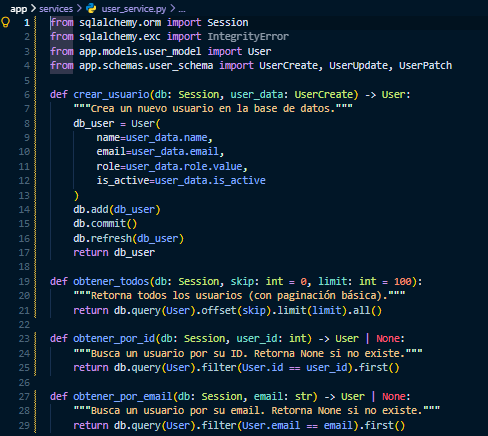

**Explicación:**  
- Cada función ahora usa el modelo `User` (SQLAlchemy) y ejecuta consultas reales.
- Para las operaciones de modificación (`add`, `update`, `delete`) se hace `commit()` para persistir los cambios.
- Se maneja la conversión de `Enum` a string en las actualizaciones.
- Se mantiene la misma interfaz que en la versión anterior, pero ahora trabaja con base de datos.

# Pruebas de la API

## 1. Creación de usuario válido POST /users (201)

**Propósito:** Verificar que se puede crear un usuario correctamente en la base de datos.

**Explicación:** Se envía una petición POST con los campos `name`, `email`, `role` e `is_active`. La API valida los datos, los guarda en SQLite y responde con código **201 Created**. La respuesta incluye el usuario creado con su `id` asignado por la base de datos y la fecha `created_at`.

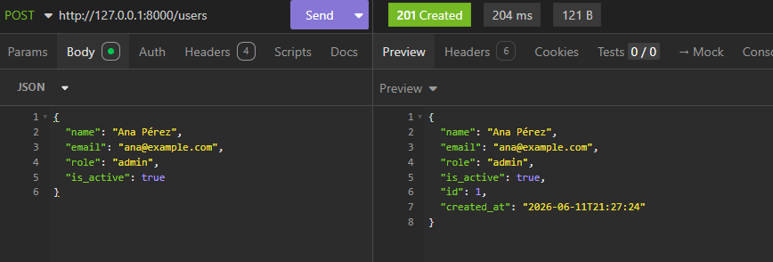

---

## 2. Email duplicado POST /users (400)

**Propósito:** Validar que la API rechaza un segundo registro con el mismo correo electrónico.

**Explicación:** Se intenta crear un usuario con un email que ya existe en la base de datos. La API detecta la duplicación, lanza una excepción `HTTPException` y responde con código **400 Bad Request** y el mensaje *"El email ya está registrado"*. Esto previene duplicados a nivel de aplicación.

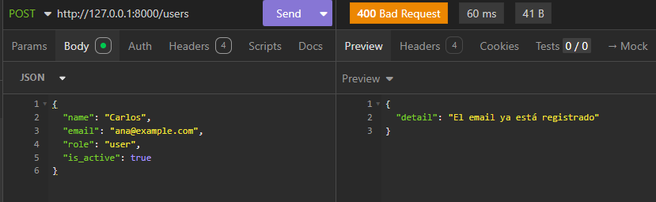

---

## 3. Datos inválidos POST /users (422)

**Propósito:** Mostrar cómo Pydantic valida automáticamente longitud, formato de email y valores permitidos.

**Explicación:** Se envía un JSON con `name` de solo 2 caracteres, `email` sin `@` y `role` no permitido (`superuser`). Pydantic rechaza la petición antes de llegar a la base de datos y responde con código **422 Unprocessable Entity**, detallando cada error.

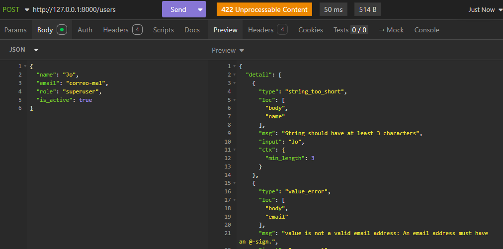

---

## 4. Lista de usuarios GET /users (200)

**Propósito:** Verificar que se pueden obtener todos los usuarios almacenados en la base de datos.

**Explicación:** Se realiza `GET /users`. La API consulta la tabla `users` y devuelve un arreglo con todos los registros. Cada usuario incluye `id`, `name`, `email`, `role`, `is_active` y `created_at`.

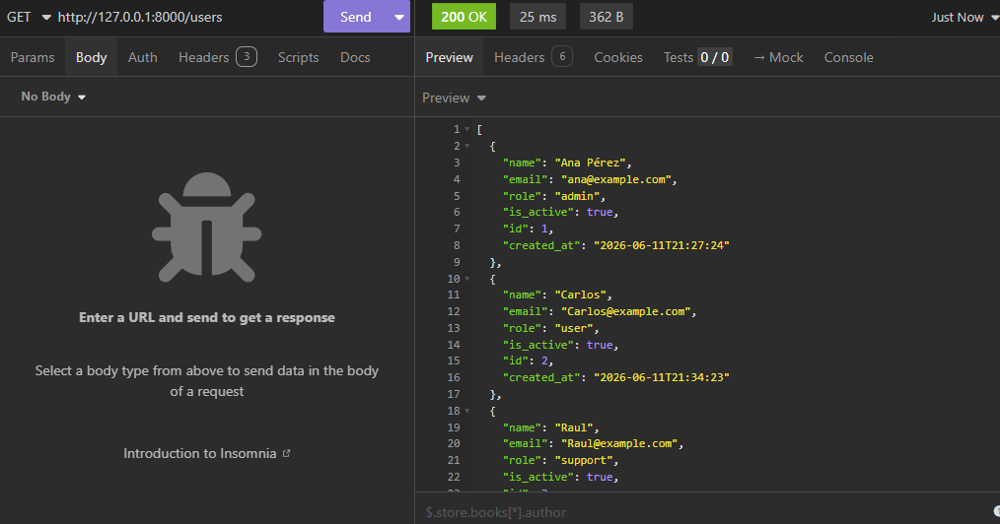

---

## 5. Filtro por rol GET /users?role=admin (200)

**Propósito:** Comprobar que el query parameter `role` filtra correctamente los usuarios por su rol.

**Explicación:** Se solicita `GET /users?role=admin`. La API construye una consulta SQL con `filter(User.role == "admin")` y retorna solo los usuarios administradores.

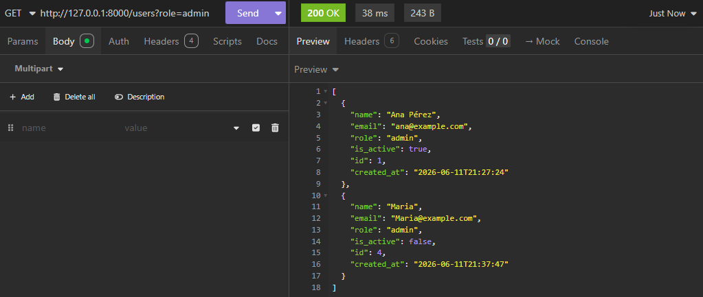

---

## 6. Filtro por estado activo GET /users?is_active=true (200)

**Propósito:** Validar que el query parameter `is_active` filtra los usuarios activos.

**Explicación:** Se ejecuta `GET /users?is_active=true`. La API aplica `filter(User.is_active == True)` y devuelve únicamente los usuarios activos.

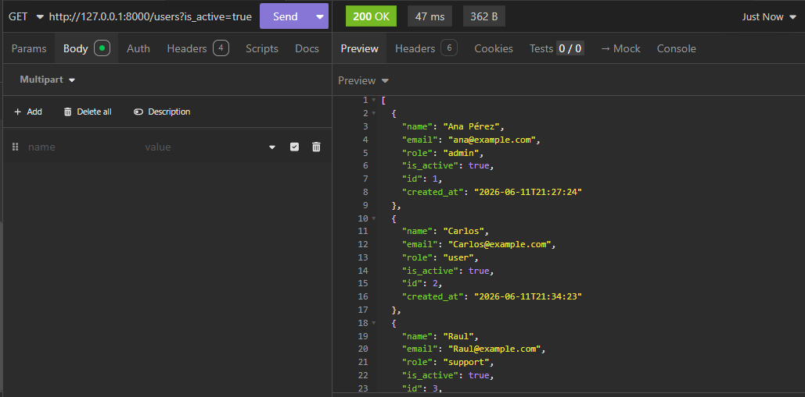

---

## 7. Obtener usuario por ID existente GET /users/1 (200)

**Propósito:** Demostrar el correcto uso de path parameter para recuperar un recurso específico.

**Explicación:** Se consulta `GET /users/1`. La API busca el usuario con `id=1` en la base de datos. Si existe, lo retorna con código **200 OK**.

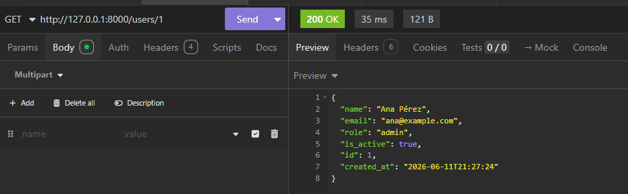

---

## 8. Usuario no encontrado GET /users/999 (404)

**Propósito:** Verificar el manejo de IDs inexistentes con error **404 Not Found**.

**Explicación:** Se solicita un ID que no existe en la base de datos (`999`). La API responde con el mensaje *"Usuario no encontrado"*.

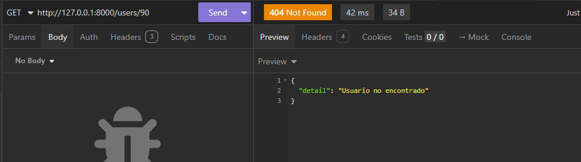

---

## 9. Actualización completa con PUT  PUT /users/1 (200)

**Propósito:** Demostrar que PUT reemplaza completamente todos los campos de un usuario existente.

**Explicación:** Se envía una petición PUT con un JSON que contiene todos los campos. La API actualiza el registro en la base de datos y devuelve el objeto modificado.

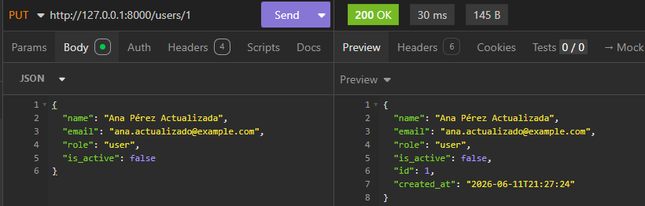

---

## 10. PUT con email duplicado  PUT /users/1 (400)

**Propósito:** Validar que PUT rechaza cambiar el email a uno ya usado por otro usuario.

**Explicación:** Se intenta actualizar el usuario con un email ya registrado por otro usuario. La API detecta el conflicto y responde con **400 Bad Request**.


--- 

## 11. PUT con ID inexistente PUT /users/999 (404)

**Propósito:** Verificar que PUT retorna **404 Not Found** cuando se intenta actualizar un recurso que no existe.

**Explicación:** La API no encuentra el usuario solicitado y responde con el mensaje *"Usuario no encontrado"*.

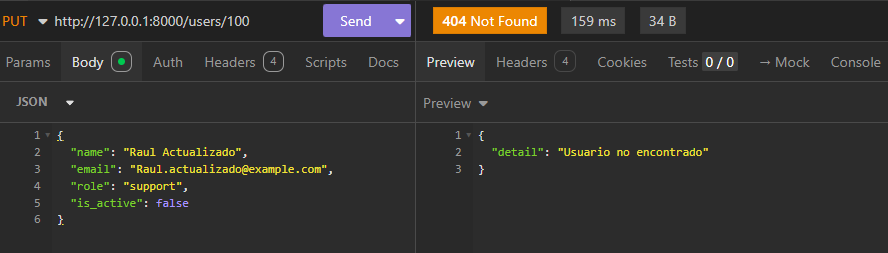

---

## 12. Actualización parcial con PATCH cambiar rol (200)

**Propósito:** Demostrar que PATCH modifica solo los campos enviados sin afectar los demás.

**Explicación:** Se envía `PATCH /users/1` con `{"role":"support"}`. La API actualiza únicamente el rol y mantiene intactos los demás datos.

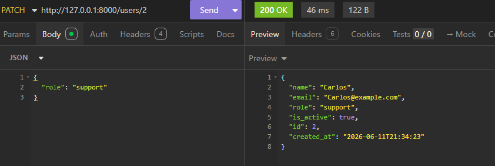

---

## 13. PATCH vacío error 400

**Propósito:** Verificar que PATCH rechaza una petición sin campos para actualizar.

**Explicación:** Se envía `PATCH /users/1` con `{}`. La API responde con **400 Bad Request**.

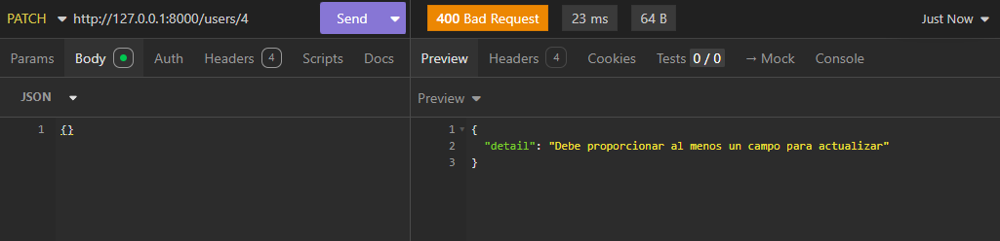

---

## 14. PATCH con ID inexistente PATCH /users/999 (404)

**Propósito:** Validar que PATCH responde con **404 Not Found** cuando el recurso no existe.

**Explicación:** Se intenta actualizar parcialmente un usuario inexistente.

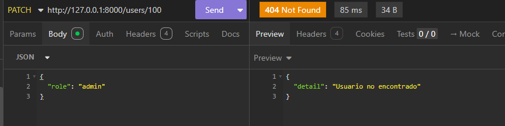

---

## 15. Eliminación exitosa DELETE /users/1 (204)

**Propósito:** Verificar que DELETE elimina correctamente un usuario existente.

**Explicación:** Se envía `DELETE /users/1`. La API elimina el registro y responde con **204 No Content**.

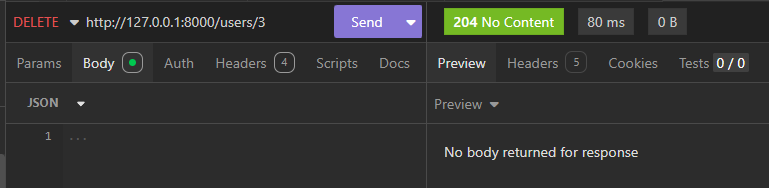

---

## 16. DELETE con ID inexistente DELETE /users/999 (404)

**Propósito:** Comprobar que DELETE retorna **404 Not Found** cuando el usuario no existe.

**Explicación:** La API responde con el mensaje *"Usuario no encontrado"*.

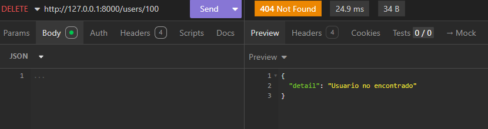

---

## 17. Swagger UI final Todos los endpoints

**Propósito:** Mostrar la documentación interactiva generada automáticamente por FastAPI.

**Explicación:** En `http://localhost:8000/docs` se listan todos los endpoints CRUD, los schemas Pydantic y los códigos de respuesta esperados.

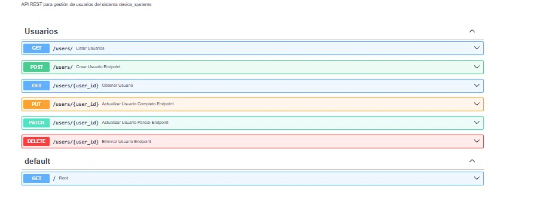
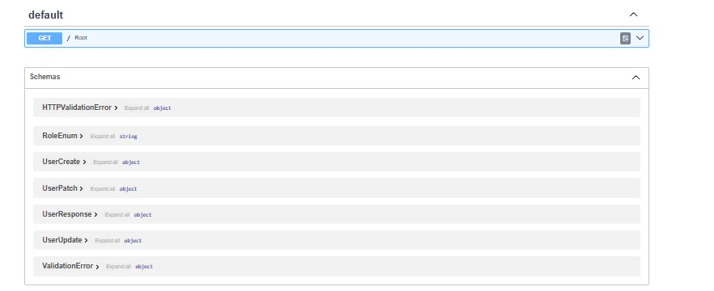

## Reflexion Final

Migrar la API de una lista en memoria a una base de datos real con SQLAlchemy fue mucho. Ya los datos no se pierden cuando se reiniciar el servidor, ya se puede hacer consultas complejas con filtros y ordenamientos, y garantias a restricciones como UNIQUE y NOT NULL. Además, separar el modelo de base de datos de SQLAlchemy de los schemas de la API que es Pydantic me ha enseñado a organizar mejor el código y a entender que cada capa tiene su responsabilidad. La persistencia no es solo guardar datos, es construir aplicaciones confiables, escalables y profesionales.

### Link Video Youtube Evidencia 9

https://youtu.be/5dIhqDU1FQ0

# Proyecto-Final-v1 GA1-220501096-01-AA1-EV10 – FastAPI Avanzado: Migraciones con Alembic, Asociaciones de Modelos y Consultas con Joins en device_systems

## Fase 1 - Retomar el proyecto anterior

Se ha creado la rama `device_systems_alembic_relaciones` para desarrollar las nuevas funcionalidades sin afectar la rama `main` (versión estable anterior). El proyecto base (`users`, CRUD, SQLAlchemy) funciona correctamente y se procederá a agregar los modelos `Device` y `Loan`, sus relaciones, migraciones con Alembic y consultas avanzadas.

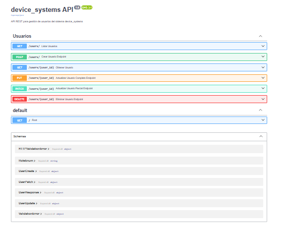

**Explicación:** La API de usuarios sigue operativa antes de agregar los nuevos modelos. Esto confirma que la base de la EV09 está estable y lista para evolucionar.

##  Fase 2 - Actualizar la estructura del proyecto
Se han agregado los archivos base para los nuevos recursos `devices` y `loans`:

- **Modelos**: `device_model.py`, `loan_model.py` (en `app/models/`)
- **Schemas**: `device_schema.py`, `loan_schema.py` (en `app/schemas/`)
- **Rutas**: `device_routes.py`, `loan_routes.py` (en `app/routes/`)
- **Servicios**: `device_service.py`, `loan_service.py` (en `app/services/`)

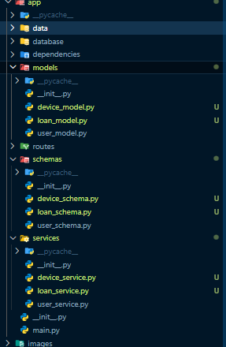

**Explicación:** La estructura ahora incluye los nuevos archivos para los modelos, schemas, rutas y servicios. El proyecto sigue funcionando sin errores, ya que los nuevos archivos no afectan la funcionalidad existente de `users`.

## Fase 3 - Instalación y configuración de Alembic

Se instaló Alembic y se configuró para gestionar migraciones de la base de datos.

### Instalación

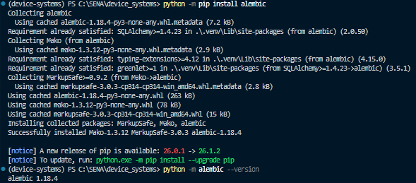

**Propósito:** Incorporar Alembic al proyecto para versionar cambios estructurales de la base de datos.

**Explicación:** Se ejecutó `pip install alembic`. Alembic permite generar y aplicar migraciones de forma controlada, facilitando la evolución del esquema de la base de datos sin perder datos.

### Inicialización de Alembic

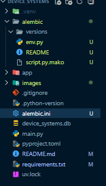

**Propósito:** Crear la estructura de carpetas y archivos necesarios para las migraciones.

**Explicación:** Se ejecutó `alembic init alembic` desde la raíz del proyecto. Esto generó la carpeta `alembic/` y el archivo `alembic.ini` con la configuración base.

### Configuración de la conexión

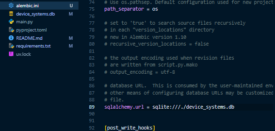

**Propósito:** Asegurar que Alembic se conecte a la base de datos correcta.

**Explicación:** En `alembic.ini` se modificó la línea `sqlalchemy.url = sqlite:///./device_systems.db` para que coincida con la URL de nuestra base de datos SQLite.

### Configuración de modelos

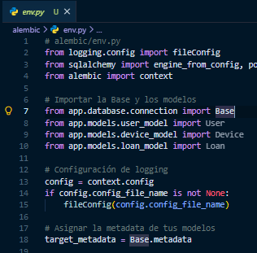

**Propósito:** Hacer que Alembic reconozca los modelos SQLAlchemy del proyecto.

**Explicación:** En `alembic/env.py` se importó la `Base` desde `app.database.connection` y los modelos `User`, `Device` y `Loan`. Luego se asignó `target_metadata = Base.metadata` para que Alembic detecte automáticamente los cambios en los modelos.

### Generación de migración inicial

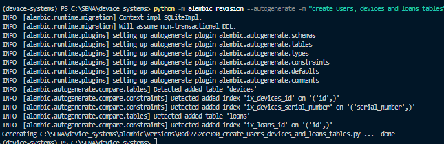

**Propósito:** Crear una migración que refleje el estado actual de los modelos.

**Explicación:** Se ejecutó `alembic revision --autogenerate -m "create devices and loans tables"`. Alembic comparó el estado actual de la base de datos con los modelos y generó automáticamente el script de migración para crear las tablas `devices` y `loans`.

### Aplicación de la migración

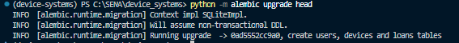

**Propósito:** Aplicar la migración a la base de datos y crear las nuevas tablas.

**Explicación:** Se ejecutó `alembic upgrade head`. Alembic aplicó todas las migraciones pendientes y creó las tablas `devices` y `loans` en la base de datos.

### Historial de migraciones

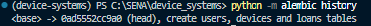

**Propósito:** Ver el historial de migraciones aplicadas.

**Explicación:** `alembic history` muestra todas las revisiones de migración existentes. En este caso aparece la migración recién creada para `devices` y `loans`.

### Verificación de las tablas generadas

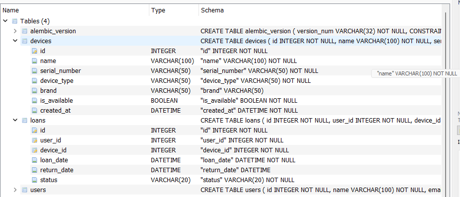

**Propósito:** Confirmar que las tablas `devices` y `loans` se crearon correctamente.

**Explicación:** Se abrió la base de datos `device_systems.db` con DB Browser for SQLite y se verificó la existencia de las nuevas tablas `devices` y `loans`. Ambas tienen la estructura definida en los modelos (columnas, claves primarias, restricciones).

# Fase 4 - Crear el modelo Device

## Objetivo

Crear el modelo `Device` en `app/models/device_model.py` con todos los campos requeridos y sus restricciones. Este modelo representará los dispositivos tecnológicos disponibles para préstamo.

---

## 1. Código del modelo Device

### Propósito

Definir la estructura de la tabla `devices` en la base de datos usando SQLAlchemy.

### Explicación

Se creó el archivo `app/models/device_model.py` con la clase `Device` que hereda de `Base`. Cada columna se define con su tipo, restricciones y valores por defecto. El campo `serial_number` se configura con `unique=True` para evitar duplicados, `is_available` tiene `default=True` para que los dispositivos estén disponibles por defecto, y `created_at` se asigna automáticamente con la fecha y hora actual mediante `func.now()`.

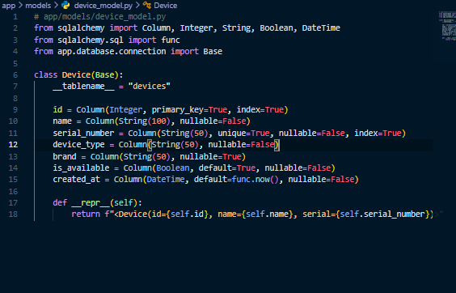

---

## 2. Importación del modelo en main.py

### Propósito

Registrar el modelo `Device` para que SQLAlchemy y Alembic lo reconozcan.

### Explicación

Se importó `Device` en `app/main.py` junto con los demás modelos, como `User`. Esto permite que Alembic detecte automáticamente los cambios realizados en `device_model.py` y genere migraciones que incluyan este nuevo modelo.


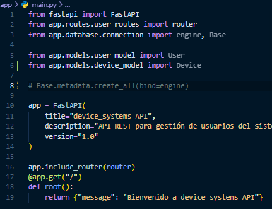

---

## 3. Tabla devices generada en la base de datos

### Propósito

Confirmar que la tabla `devices` fue creada correctamente por Alembic.

### Explicación

Se abrió la base de datos `device_systems.db` utilizando DB Browser for SQLite y se verificó que la tabla `devices` existe con todas sus columnas:

- `id` (clave primaria)
- `name` (obligatorio)
- `serial_number` (único)
- `device_type` (obligatorio)
- `brand` (opcional)
- `is_available` (booleano con valor predeterminado `True`)
- `created_at` (fecha de creación automática)

También se confirmó que el campo `serial_number` posee la restricción `UNIQUE`, garantizando que no existan números de serie duplicados.

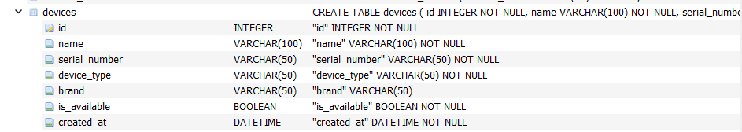

---

# Fase 5 - Crear el modelo Loan

## objetivo

Crear el archivo `app/models/loan_model.py`. El modelo `Loan` debe representar el préstamo de un dispositivo a un usuario.

---

## 1. Código del modelo Loan

### Propósito

Definir la estructura de la tabla `loans` en la base de datos.

### Explicación

Se creó el archivo `app/models/loan_model.py` con la clase `Loan` que hereda de `Base`. El modelo incluye columnas para `user_id` y `device_id` como `ForeignKey` hacia las tablas `users` y `devices`, respectivamente.

También incluye:

- `loan_date`: fecha de préstamo generada automáticamente.
- `return_date`: fecha de devolución opcional.
- `status`: estado del préstamo, con valor predeterminado `active`.

Además, se definieron las relaciones bidireccionales utilizando `relationship()` para permitir la navegación entre usuarios, dispositivos y préstamos.

### Evidencia

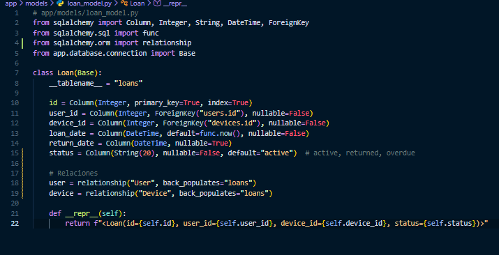

---

## 2. Relaciones en los modelos User y Device

### Relación User → Loan

### Propósito

Establecer la relación **One-to-Many** entre `User` y `Loan`.

### Explicación

En `app/models/user_model.py` se agregó la siguiente relación:

```python
loans = relationship("Loan", back_populates="user")
```

Esto permite que desde un objeto `User` se pueda acceder a todos sus préstamos mediante `user.loans`, y desde un objeto `Loan` se pueda acceder a su usuario asociado mediante `loan.user`.

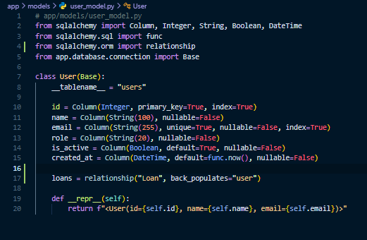

---

### Relación Device → Loan

### Propósito

Establecer la relación **One-to-Many** entre `Device` y `Loan`.

### Explicación

En `app/models/device_model.py` se agregó la siguiente relación:

```python
loans = relationship("Loan", back_populates="device")
```

Esto permite que desde un objeto `Device` se pueda acceder al historial de préstamos mediante `device.loans`, y desde un objeto `Loan` se pueda acceder al dispositivo asociado mediante `loan.device`.

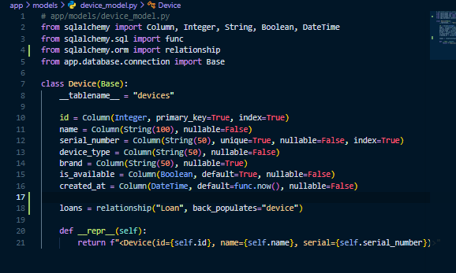

---

## 3. Importación de todos los modelos en main.py

### Propósito

Registrar todos los modelos para que Alembic los detecte y SQLAlchemy los reconozca.

### Explicación

En `app/main.py` se importaron los tres modelos:

- `User`
- `Device`
- `Loan`

Esto garantiza que Alembic tenga conocimiento de todas las entidades y sus relaciones al momento de generar migraciones.


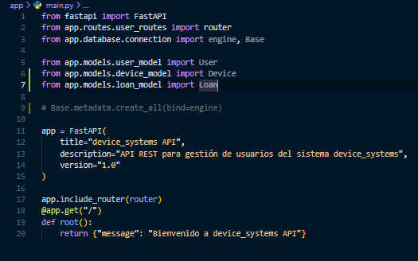

---

## 4. Generación y aplicación de migraciones

### Generación de la migración

#### Propósito

Crear una migración que refleje los cambios realizados en los modelos y sus relaciones.

#### Explicación

Se ejecutó el siguiente comando:

```bash
python -m alembic revision --autogenerate -m "add relationships to loans and update models"
```

Alembic detectó automáticamente las nuevas relaciones y generó el script de migración correspondiente.

#### Evidencia

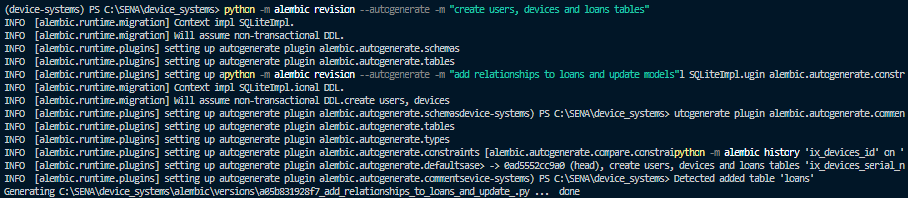

---

### Aplicación de la migración

#### Propósito

Actualizar la base de datos con las nuevas relaciones y claves foráneas.

#### Explicación

Se ejecutó el siguiente comando:

```bash
python -m alembic upgrade head
```

Alembic aplicó la migración y actualizó la base de datos para incluir las relaciones entre las tablas `users`, `devices` y `loans`.

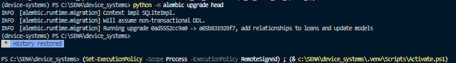

---

## 5. Verificación de la tabla loans

### Propósito

Confirmar que la tabla `loans` fue creada correctamente con todas sus columnas y restricciones.

### Explicación

Se abrió la base de datos `device_systems.db` mediante DB Browser for SQLite y se verificó que la tabla `loans` contiene las siguientes columnas:

| Campo | Descripción |
|---------|---------|
| `id` | Clave primaria |
| `user_id` | Foreign Key hacia `users.id` |
| `device_id` | Foreign Key hacia `devices.id` |
| `loan_date` | Fecha automática de préstamo |
| `return_date` | Fecha de devolución opcional |
| `status` | Estado actual del préstamo |

También se confirmó que las claves foráneas (`Foreign Keys`) fueron creadas correctamente y mantienen la integridad referencial entre las tablas.

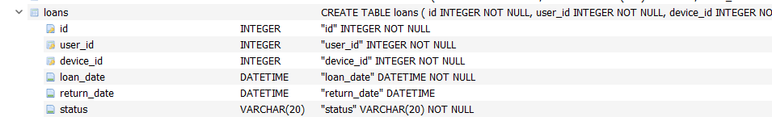

---

# Fase 6 - Definir asociaciones entre modelos

## Objetivo

Implementar relaciones bidireccionales entre los modelos `User`, `Device` y `Loan` utilizando `relationship()` y `back_populates`. Esto permite navegar entre objetos relacionados de forma natural y simplifica las consultas a la base de datos.

---

## Relaciones definidas

| Relación | Tipo | Descripción |
|-----------|-----------|-----------|
| `User.loans` → `Loan` | One-to-Many | Un usuario puede tener muchos préstamos |
| `Device.loans` → `Loan` | One-to-Many | Un dispositivo puede tener muchos préstamos históricos |
| `Loan.user` → `User` | Many-to-One | Cada préstamo pertenece a un usuario |
| `Loan.device` → `Device` | Many-to-One | Cada préstamo está asociado a un dispositivo |

---

## 1. Relación entre User y Loan

### Código implementado en `user_model.py`

```python
loans = relationship("Loan", back_populates="user")
```

### Propósito

Establecer la relación entre un usuario y sus préstamos.

### Explicación

Se agregó la siguiente relación al modelo `User`:

```python
loans = relationship("Loan", back_populates="user")
```

Esta configuración permite acceder a todos los préstamos asociados a un usuario mediante:

```python
usuario.loans
```

Gracias a esta relación, SQLAlchemy puede recuperar automáticamente todos los préstamos relacionados con un usuario específico.

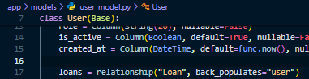

---

## 2. Relación entre Device y Loan

### Código implementado en `device_model.py`

```python
loans = relationship("Loan", back_populates="device")
```

### Propósito

Establecer la relación entre un dispositivo y su historial de préstamos.

### Explicación

Se agregó la siguiente relación al modelo `Device`:

```python
loans = relationship("Loan", back_populates="device")
```

Esta relación permite consultar todos los préstamos asociados a un dispositivo mediante:

```python
dispositivo.loans
```

De esta forma es posible conocer el historial completo de préstamos de cualquier dispositivo registrado.


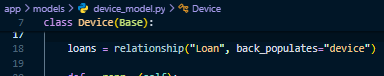

---

## 3. Relación entre Loan, User y Device

### Código implementado en `loan_model.py`

```python
user = relationship("User", back_populates="loans")
device = relationship("Device", back_populates="loans")
```

### Propósito

Conectar cada préstamo con el usuario y el dispositivo asociados.

### Explicación

Se agregaron dos relaciones al modelo `Loan`:

```python
user = relationship("User", back_populates="loans")
device = relationship("Device", back_populates="loans")
```

Estas relaciones permiten acceder directamente a los datos relacionados desde un préstamo:

- Obtener el usuario asociado:

```python
prestamo.user
```

- Obtener el dispositivo asociado:

```python
prestamo.device
```

Gracias a esto, cada préstamo puede navegar fácilmente hacia su usuario y dispositivo sin necesidad de realizar consultas manuales adicionales.

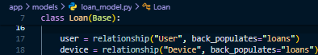

---

## Fase 7 - Crear schemas Pydantic

Se crearon los schemas Pydantic para los nuevos recursos `devices` y `loans`. Estos schemas definen la estructura de los datos de entrada y salida de la API, garantizando validación automática y documentación clara.

### Schemas para dispositivos (`device_schema.py`)

| Schema | Propósito | Campos |
|--------|-----------|--------|
| `DeviceCreate` | Crear un nuevo dispositivo | name, serial_number, device_type, brand (opcional), is_available |
| `DeviceUpdate` | Actualizar completamente un dispositivo | Mismos que DeviceCreate |
| `DeviceResponse` | Respuesta de la API | Todos los campos anteriores + id, created_at |

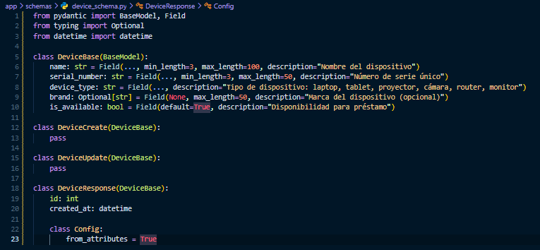

**Propósito:** Definir la estructura de datos para el recurso `devices`.

**Explicación:** Se creó `app/schemas/device_schema.py` con los schemas de entrada (`DeviceCreate`, `DeviceUpdate`) y salida (`DeviceResponse`). Todos los campos tienen validaciones (longitud mínima, tipos) y descripciones para la documentación automática.

### Schemas para préstamos (`loan_schema.py`)

| Schema | Propósito | Campos |
|--------|-----------|--------|
| `LoanCreate` | Crear un nuevo préstamo | user_id, device_id |
| `LoanUpdate` | Actualizar estado del préstamo | status (opcional) |
| `LoanResponse` | Respuesta simple de préstamo | id, user_id, device_id, loan_date, return_date, status |
| `LoanDetailResponse` | Respuesta detallada con información relacionada | id, loan_date, return_date, status + información del usuario (`UserBasicInfo`) y dispositivo (`DeviceBasicInfo`) |
| `UserBasicInfo` | Info básica de usuario (para respuestas anidadas) | id, name, email |
| `DeviceBasicInfo` | Info básica de dispositivo (para respuestas anidadas) | id, name, serial_number, device_type, brand, is_available |

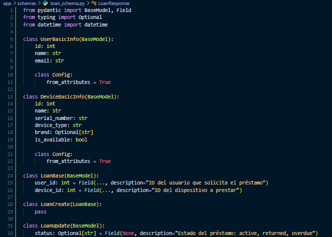
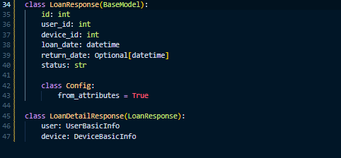

**Propósito:** Definir la estructura de datos para el recurso `loans`.

**Explicación:** Se creó `app/schemas/loan_schema.py` con schemas para creación (`LoanCreate`), actualización (`LoanUpdate`), respuesta simple (`LoanResponse`) y respuesta detallada (`LoanDetailResponse`) que incluye información anidada del usuario y dispositivo usando los schemas auxiliares `UserBasicInfo` y `DeviceBasicInfo`.

## Fase 8 - Implementar CRUD de dispositivos

Se implementaron los endpoints para gestionar dispositivos tecnológicos, incluyendo filtros avanzados para búsquedas personalizadas.

### Servicio (`device_service.py`)

Se creó `app/services/device_service.py` con las funciones CRUD y los filtros.

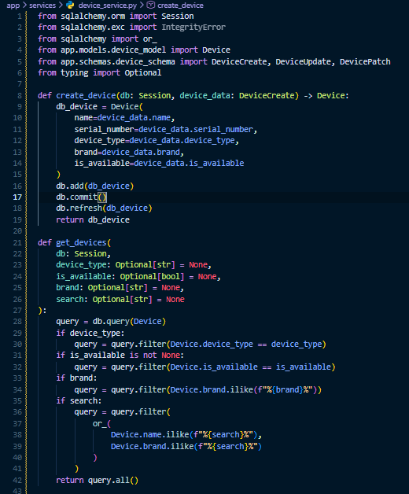

**Propósito:** Contener toda la lógica de base de datos para el recurso `devices`.

**Explicación:** El servicio incluye funciones para crear, listar (con filtros), obtener por ID, actualizar completo, actualizar parcial y eliminar dispositivos. Los filtros permiten buscar por `device_type`, `is_available`, `brand` (búsqueda parcial) y `search` (que busca en `name` y `brand` usando `ilike`).

### Rutas (`device_routes.py`)

Se crearon los seis endpoints para el recurso `devices`.

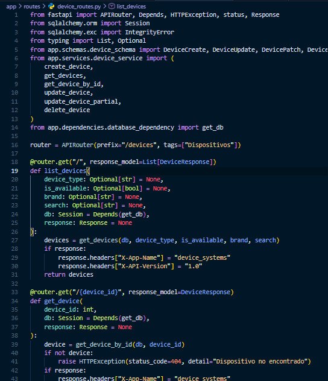

**Propósito:** Exponer los endpoints HTTP para la gestión de dispositivos.

**Explicación:** Cada endpoint utiliza las funciones del servicio y maneja errores como "dispositivo no encontrado" (404) y "número de serie duplicado" (400). Todas las respuestas incluyen las cabeceras personalizadas `X-App-Name` y `X-API-Version`.

### Pruebas de los endpoints

#### Creación de dispositivo exitosa (POST)
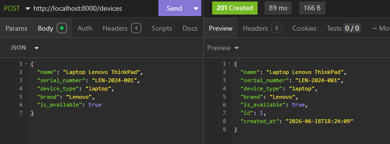

**Propósito:** Verificar que se puede crear un dispositivo correctamente.

**Explicación:** Se envía un JSON con `name`, `serial_number`, `device_type`, `brand` (opcional) e `is_available`. La API valida los datos, los guarda en SQLite y responde con código **201 Created**. Si el `serial_number` ya existe, devuelve **400 Bad Request**.

#### Lista de dispositivos (GET)
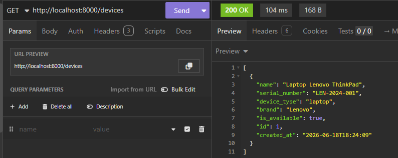

**Propósito:** Mostrar todos los dispositivos registrados.

**Explicación:** `GET /devices` retorna todos los dispositivos con código **200 OK**. Cada dispositivo incluye `id`, `name`, `serial_number`, `device_type`, `brand`, `is_available` y `created_at`.

#### Filtro por tipo de dispositivo
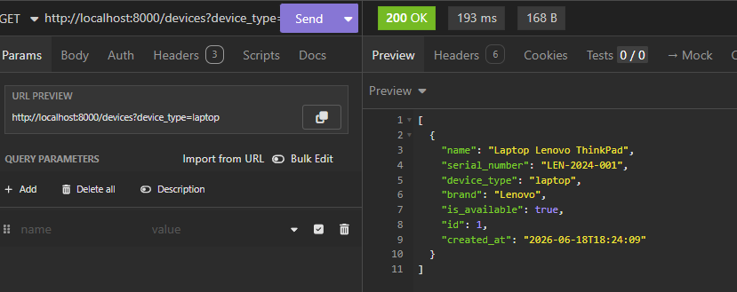

**Propósito:** Verificar el filtro por `device_type`.

**Explicación:** `GET /devices?device_type=laptop` retorna solo los dispositivos que coinciden con ese tipo.

#### Filtro por disponibilidad
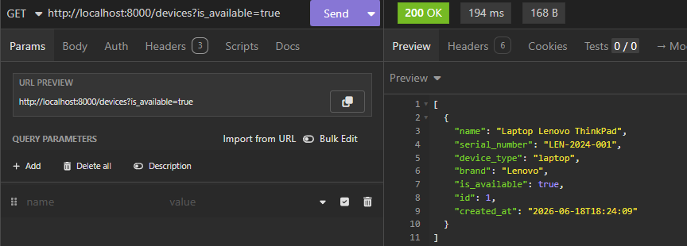

**Propósito:** Verificar el filtro por `is_available`.

**Explicación:** `GET /devices?is_available=true` retorna solo los dispositivos disponibles para préstamo.

#### Búsqueda por nombre o marca
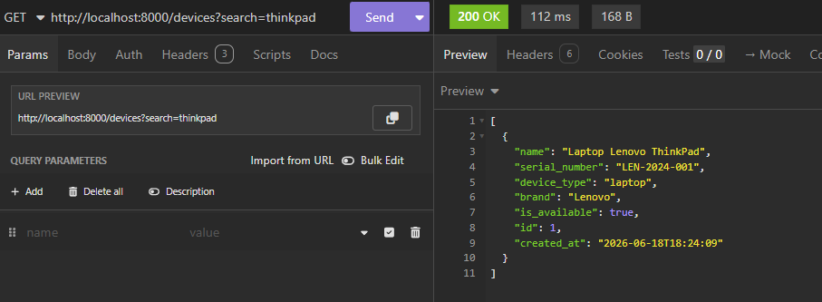

**Propósito:** Verificar la búsqueda con `search`.

**Explicación:** `GET /devices?search=thinkpad` busca en `name` y `brand` usando `ilike` para encontrar coincidencias parciales (insensible a mayúsculas).

## Actualización completa con PUT

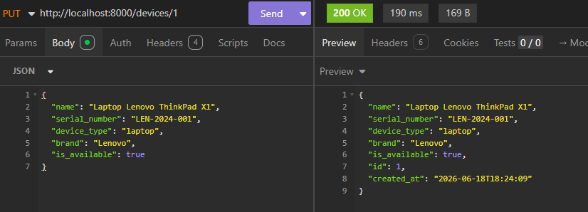

**Propósito:** Demostrar que PUT reemplaza completamente todos los campos de un dispositivo existente.

**Explicación:** Se envía una petición PUT con un JSON que contiene todos los campos (`name`, `serial_number`, `device_type`, `brand`, `is_available`). La API actualiza el registro en la base de datos y devuelve el objeto modificado con código 200 OK. El `id` y `created_at` no cambian.

## PUT con ID inexistente (404)

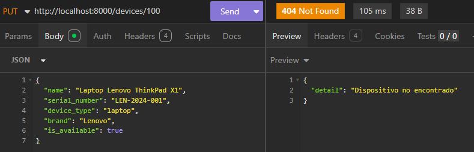

**Propósito:** Verificar que PUT retorna 404 Not Found cuando se intenta actualizar un dispositivo que no existe.

**Explicación:** Se envía `PUT /devices/999` con datos válidos. La API no encuentra el dispositivo y lanza `HTTPException(404)` con el mensaje `"Dispositivo no encontrado"`.

## Actualización parcial con PATCH

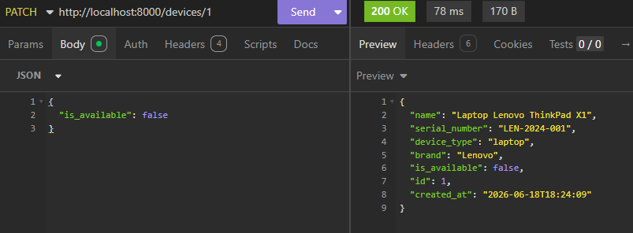

**Propósito:** Demostrar que PATCH modifica solo los campos enviados sin afectar los demás.

**Explicación:** Se envía `PATCH /devices/1` con `{"is_available": false}`. La API actualiza solo el campo `is_available` en la base de datos y devuelve el dispositivo completo con el resto de los campos intactos. Código 200 OK.

## PATCH vacío (400)

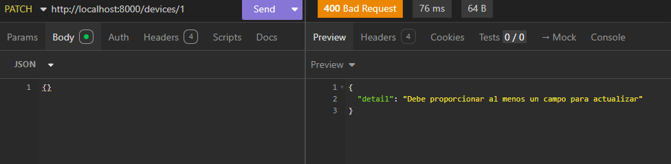

**Propósito:** Verificar que PATCH rechaza una petición que no incluye ningún campo para actualizar.

**Explicación:** Se envía `PATCH /devices/1` con un cuerpo vacío `{}`. La API detecta que no hay campos a modificar y responde con 400 Bad Request y el mensaje `"Debe proporcionar al menos un campo para actualizar"`.

## PATCH con ID inexistente (404)

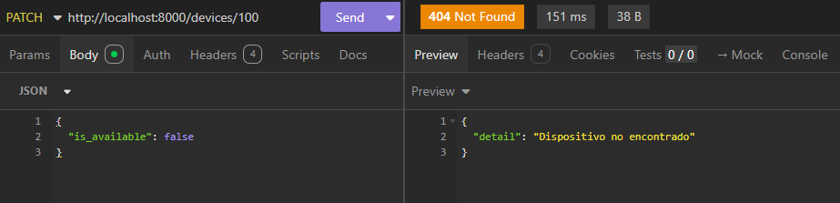

**Propósito:** Validar que PATCH responde con 404 Not Found cuando el recurso no existe.

**Explicación:** Se intenta actualizar parcialmente un dispositivo con ID 999, que no existe. La API lanza `HTTPException(404)` con el mensaje `"Dispositivo no encontrado"`.

#### Eliminación de dispositivo (DELETE)
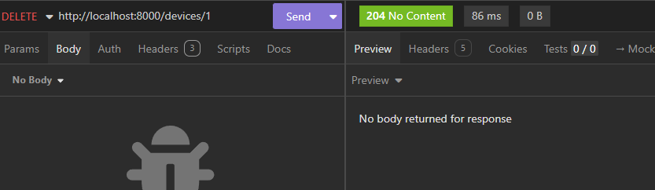

**Propósito:** Verificar que se puede eliminar un dispositivo.

**Explicación:** `DELETE /devices/1` elimina el dispositivo y responde con **204 No Content**. Si el ID no existe, responde con **404 Not Found**.

### Documentación Swagger actualizada

Con los nuevos endpoints, Swagger UI ahora muestra el recurso `Dispositivos` completo con todos los schemas y códigos de respuesta.

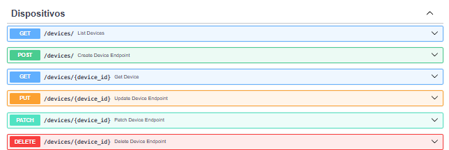
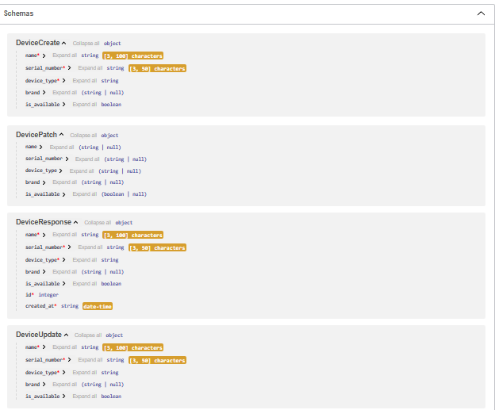