# GA1-220501096-01-AA1-EV07 – Fundamentos de FastAPI: API REST para Gestión de Usuarios

## Descripción de la aplicación

**device_systems** es una API REST desarrollada con **FastAPI** que permite administrar usuarios del sistema.  
Esta aplicación backend expone endpoints para **listar usuarios**, **consultar un usuario por ID**, **filtrar usuarios por rol y estado**, y **crear nuevos usuarios** con validaciones robustas.

La API está construida siguiendo los principios REST y utiliza:

- **Pydantic v2** para la validación automática de datos y definición de esquemas.
- **Parámetros de ruta** para acceder a recursos específicos.
- **Parámetros de consulta** para filtrar y personalizar respuestas.
- **Modelos de respuesta** para estandarizar la salida y ocultar información sensible.
- **Cabeceras HTTP personalizadas** para identificar la aplicación y su versión.

Este proyecto es el resultado de un reto integrador que consolida los fundamentos de FastAPI, demostrando su capacidad para crear APIs eficientes, autodocumentadas y fáciles de mantener.

---

## Instalación de dependencias

Para que la API funcione correctamente, necesitamos instalar tres componentes principales:

| Dependencia | ¿Para qué sirve? |
|---|---|
| FastAPI | Es el motor de la API. Proporciona todas las herramientas para crear los endpoints (rutas) y manejar las peticiones HTTP. |
| Uvicorn | Es el servidor que pone en marcha la API y la mantiene a la escucha de peticiones (como un recepcionista que atiende llamadas). |
| email-validator | Es una pequeña ayuda que permite verificar que los correos electrónicos tengan un formato válido (por ejemplo, que contengan un `@` y un dominio). |

Estas dependencias se instalan automáticamente con el siguiente comando:

```bash
python -m uv add fastapi uvicorn[standard] email-validator
```
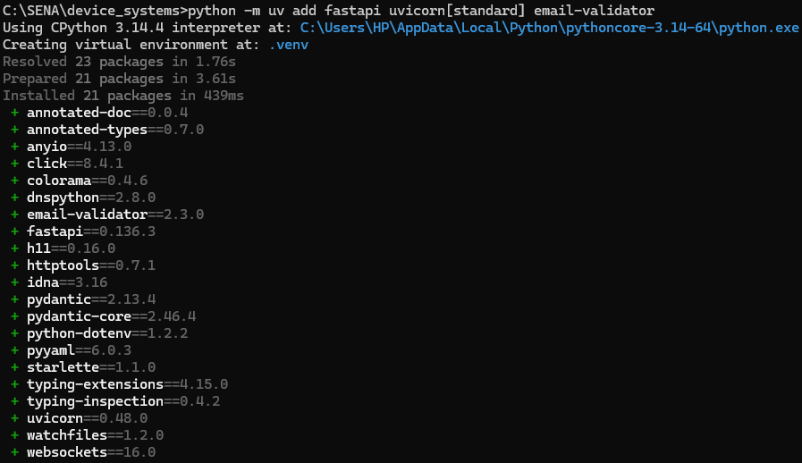
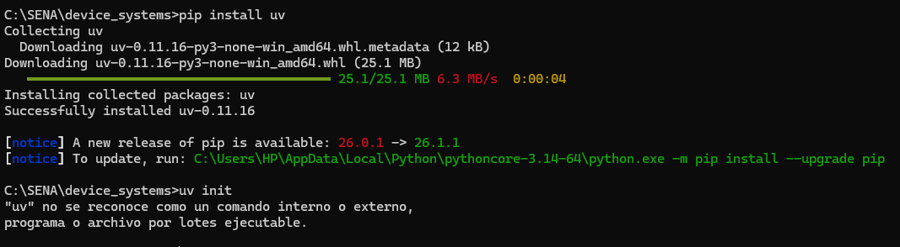
---

## Ejecución del servidor

Una vez instaladas las dependencias, dentro de la carpeta `device_systems` ejecuta:

```bash
python -m uv run uvicorn app.main:app --
```

**Salida:**
INFO:     Will watch for changes in these directories: ['C:\\SENA\\device_systems']

INFO:     Uvicorn running on http://127.0.0.1:8000 (Press CTRL+C to quit)

INFO:     Started reloader process [5808] using WatchFiles

INFO:     Started server process [20468]

INFO:     Waiting for application startup.

INFO:     Application startup complete.

Acceso a la API y documentación API base: http://localhost:8000

Swagger UI (documentación interactiva): http://localhost:8000/docs

---

## Endpoints de la API

A continuación se describe cada uno de los **endpoints disponibles** en la API `device_systems`. Se incluyen los métodos HTTP, rutas, descripción, parámetros y códigos de respuesta esperados.

| Método | Ruta | Descripción | Parámetros | Códigos de respuesta |
|--------|------|-------------|------------|----------------------|
| GET | `/` | Mensaje de bienvenida a la API | Ninguno | 200 OK |
| GET | `/users` | Lista todos los usuarios (con filtros opcionales) | `role` (query, opcional, valores: `admin`, `support`, `user`)<br>`is_active` (query, opcional, `true`/`false`) | 200 OK |
| GET | `/users/{user_id}` | Obtiene un usuario por su ID | `user_id` (path, entero, requerido) | 200 OK, 404 Not Found |
| POST | `/users` | Crea un nuevo usuario | Body JSON con los campos: `name`, `email`, `role`, `is_active` | 201 Created, 400 Bad Request, 422 Unprocessable Entity |
| PUT | `/users/{user_id}` | Actualiza un usuario | Body JSON completo (mismos campos que POST) | 200 OK, 404, 400 |
| PATCH | `/users/{user_id}` | Actualiza parcialmente un usuario | Body JSON con uno o más campos | 200 OK, 404, 400 |
| DELETE | `/users/{user_id}` | Elimina un usuario | Ninguno | 204 No Content (o 200 OK), 404 |

El endpoint `GET /users` acepta `role` e `is_active` como **query parameters** (parámetros de consulta). Esto permite filtrar la lista de usuarios sin necesidad de crear múltiples rutas fijas.

---

## Ejemplos de peticiones GET y POST

###  GET /users (sin filtros)
```bash
curl -X GET "http://localhost:8000/users"
```

### GET /users con filtros
```bash
curl -X GET "http://localhost:8000/users?role=admin&is_active=true"
```

### GET /users/{user_id}
```bash
curl -X GET "http://localhost:8000/users/1"
```

### POST /users (creación válida)
```bash
curl -X POST "http://localhost:8000/users" \
  -H "Content-Type: application/json" \
  -d '{
    "name": "Carlos Mendoza",
    "email": "carlos@example.com",
    "role": "support",
    "is_active": true
  }'
```

### POST /users (datos inválidos – error 422)
```bash
curl -X POST "http://localhost:8000/users" \
  -H "Content-Type: application/json" \
  -d '{
    "name": "Jo",
    "email": "correo-mal",
    "role": "superuser",
    "is_active": true
  }'
```
---

## Evidencias de pruebas con capturas de pantalla

A continuación se muestran las capturas realizadas durante las pruebas de la API `device_systems`. Cada imagen demuestra el correcto funcionamiento de los endpoints, las validaciones, el manejo de errores y las cabeceras personalizadas.

---

### 1. Documentación Swagger UI completa

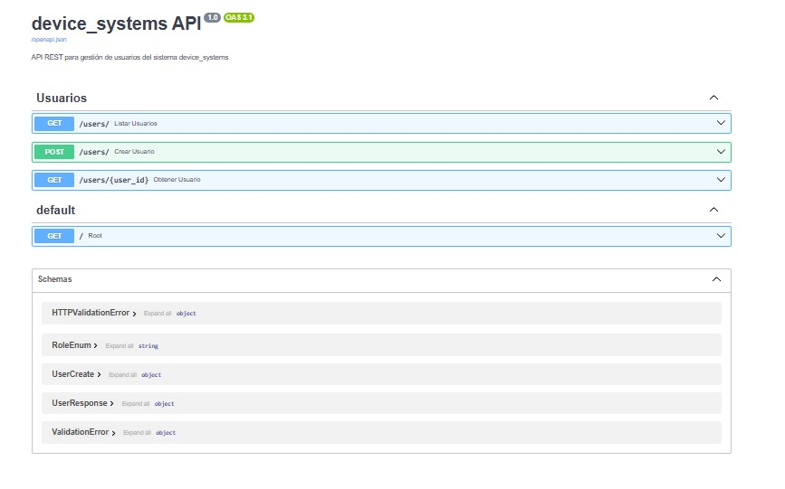

**Propósito:** Mostrar la interfaz autogenerada por FastAPI donde se documentan automáticamente todos los endpoints, parámetros, modelos de datos y códigos de respuesta.

**Explicación:** En `http://localhost:8000/docs` se listan los endpoints `GET /users`, `GET /users/{user_id}`, `POST /users` y el raíz `GET /`. Además, se visualizan los schemas `UserCreate`, `UserResponse`, `RoleEnum` y los errores de validación. Esta documentación es interactiva y permite probar la API directamente desde el navegador.

---

### 2. Lista inicial vacía – `GET /users`

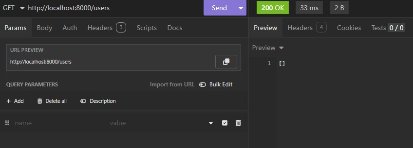

**Propósito:** Verificar que al iniciar la API no hay usuarios precargados en el sistema.

**Explicación:** Inmediatamente después de que se ejecuto el servidor, se realiza una petición `GET /users` desde Insomnia. La respuesta es un arreglo vacío `[]`, lo cual es correcto porque aún no se ha creado ningún usuario.

---

### 3. Creación de usuario válido – `POST /users` (código 201)

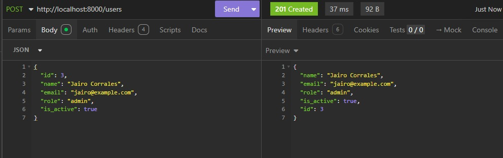

**Propósito:** Demostrar que se puede registrar un nuevo usuario correctamente.

**Explicación:** Se envía una petición POST con un JSON que contiene `name`, `email`, `role` e `is_active`. FastAPI valida los datos con Pydantic, los almacena en memoria y responde con código **201 Created**. La respuesta incluye el objeto completo del usuario creado, con el `id: 3` asignado automáticamente.

---

### 4. Filtrado con query parameters – `GET /users?role=admin&is_active=true`

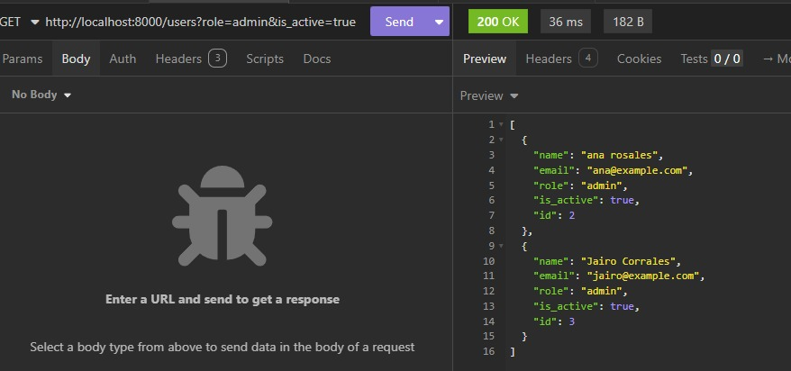

**Propósito:** Comprobar que los parámetros de consulta `role` e `is_active` permiten filtrar la lista de usuarios.

**Explicación:** Se realiza `GET /users?role=admin&is_active=true`. La API retorna únicamente los usuarios cuyo rol es `admin` y que están activos. En la captura aparecen `ana rosales` (id=2) y `Jairo Corrales` (id=3), ambos administradores activos. Y los usuarios `Lucía Ruiz` que es rol `user` y `Carlos Mendoza` que es rol `support` no aparecen porque no cumplen el filtro.

---

### 5. Obtener usuario por ID existente – `GET /users/1`

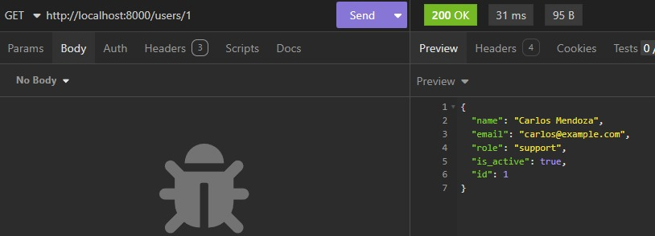

**Propósito:** Validar que el **path parameter** `{user_id}` funciona correctamente y retorna el recurso solicitado.

**Explicación:** Se consulta `GET /users/1`. FastAPI extrae el valor `1` de la URL. En este caso, retorna a `Carlos Mendoza` con rol `support` y código **200 OK**. Esto demuestra el correcto uso de parámetros de ruta.

---

### 6. Usuario no encontrado – `GET /users/100` (código 404)

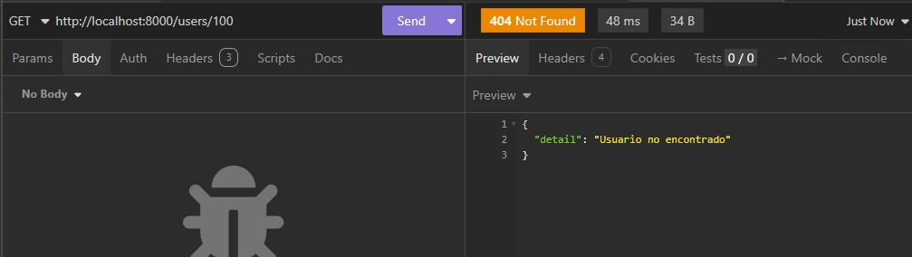

**Propósito:** Verificar el manejo de IDs inexistentes con un error **404 Not Found** y un mensaje descriptivo.

**Explicación:** Se solicita `GET /users/100`, un ID que no existe en la base de datos. La API responde con código **404 Not Found** y el mensaje `"Usuario no encontrado"`. Este comportamiento sigue el estándar REST y permite al cliente saber que el recurso no existe sin ambigüedad.

---

### 7. Segunda creación de usuario válido – `POST /users` (código 201)

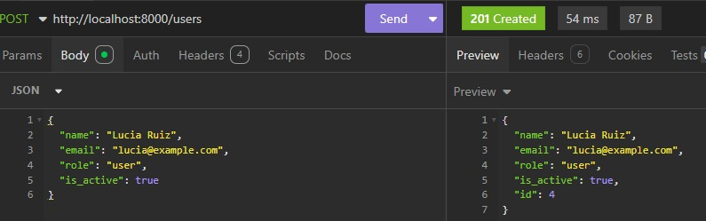

**Propósito:** Demostrar que se pueden crear múltiples usuarios y que el ID se incrementa correctamente.

**Explicación:** Se crea un nuevo usuario llamado `Lucía Ruiz` con rol `user`. La respuesta es **201 Created** y se le asigna el `id: 4`. Esto confirma que el contador de IDs funciona de forma incremental y que no hay conflictos entre registros.

---

### 8. Error por email duplicado – `POST /users` (código 400)

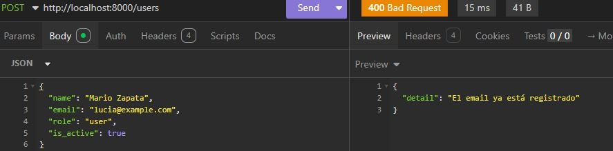

**Propósito:** Validar que la API rechaza un segundo registro con el mismo correo electrónico, previniendo duplicados.

**Explicación:** Se intenta crear un usuario con el email `luci@example.com` (similar al de Lucía Ruiz, pero con una letra menos). El mensaje de error es `"El email ya está registrado"`. Esto demuestra que antes de guardar, la API verifica la unicidad del email y devuelve un **400 Bad Request**.

---

### 9. Validación de nombre muy corto – `POST /users` (código 422)

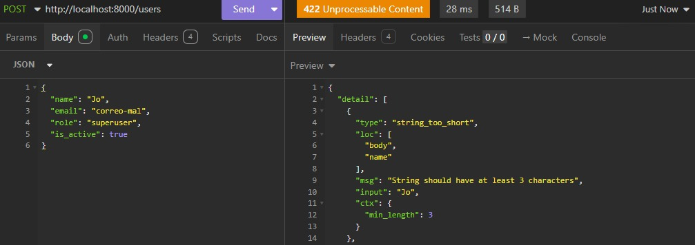

**Propósito:** Mostrar cómo Pydantic valida que el campo `name` tenga al menos 3 caracteres.

**Explicación:** Se envía `"name": "Jo"` (solo 2 caracteres). La API responde con **422 Unprocessable Entity** y un detalle que indica: `"String should have at least 3 characters"` en la ubicación `body.name`. Esta validación automática evita nombres demasiado cortos.

---

### 10. Validación de email inválido – `POST /users` (código 422)

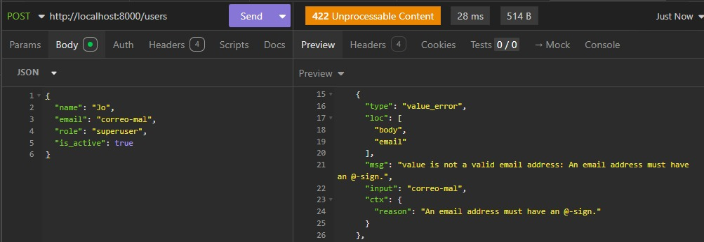

**Propósito:** Comprobar que el campo `email` debe tener un formato válido (con `@` y dominio).

**Explicación:** Se envía `"email": "correo-mal"` sin el símbolo `@`. Pydantic (con `EmailStr`) rechaza el valor y devuelve un error 422 con el mensaje: `"value is not a valid email address: An email address must have an @-sign."`. Esto garantiza que solo correos bien formados sean aceptados.

---

### 11. Validación de rol no permitido – `POST /users` (código 422)

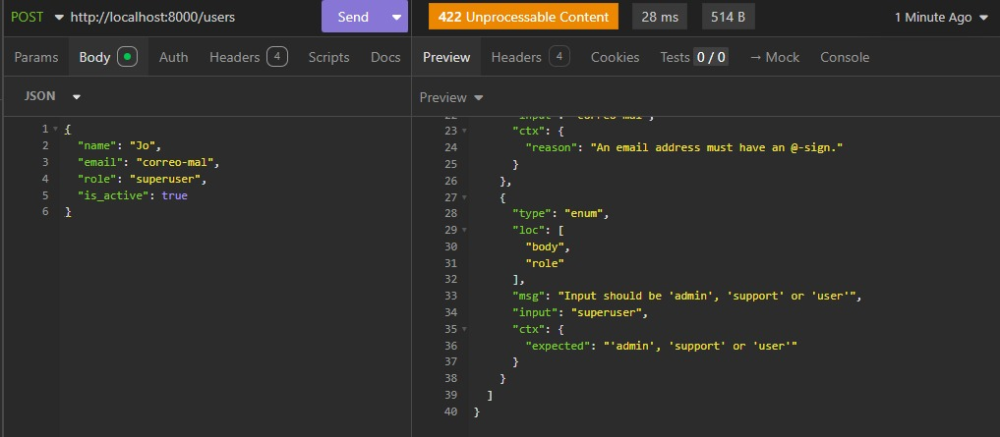

**Propósito:** Verificar que el campo `role` solo acepte los valores `admin`, `support` o `user`.

**Explicación:** Se envía `"role": "superuser"` que no está en el `Enum`. La respuesta 422 indica: `"Input should be 'admin', 'support' or 'user'"`. Esto restringe los roles a los definidos en el sistema.

---

### 12. Cabeceras HTTP personalizadas

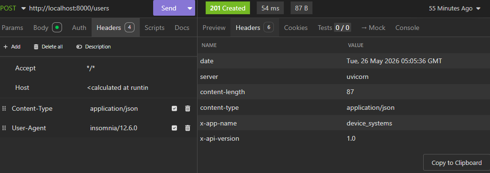

**Propósito:** Verificar que todas las respuestas incluyen las cabeceras `X-App-Name` y `X-API-Version`.

**Explicación:** En la pestaña `Headers` de Insomnia se puede ver las cabeceras de respuesta. Además de las cabeceras estándar (`server`, `content-type`, etc.), la API añade `X-App-Name: device_systems` y `X-API-Version: 1.0`. Estas cabeceras personalizadas permiten identificar la aplicación y su versión en cada comunicación cliente-servidor.

---

## Reflexión sobre el uso de FastAPI para construir APIs REST

Al desarrollar esta api

- **Validación automática:** Pydantic valida tipos, longitudes, emails y roles sin escribir código adicional. Los errores 422 son claros y específicos.
- **Documentación interactiva:** Swagger UI se genera solo con el código, permitiendo probar endpoints sin herramientas externas.
- **Parámetros de ruta y consulta:** FastAPI distingue automáticamente entre `{user_id}` y `?role=admin`, lo que simplifica el código.
- **Manejo de errores:** Con `HTTPException` se pueden devolver códigos 400, 404 y mensajes personalizados.
- **Cabeceras personalizadas:** Se añaden fácilmente con `response.headers`.

FastAPI hace que se acelere el desarrollo, reduce errores y produce APIs bien estructuradas y autodocumentadas. Es una excelente opción para proyectos backend modernos.


### Link Video Youtube Evidencia 7

https://youtu.be/G8Z5m7-ULBk

# GA1-220501096-01-AA1-EV08 – FastAPI Intermedio: Evolución de device_systems con CRUD Completo, Manejo de Errores, Swagger/OpenAPI y Dependency Injection

## Estructura del proyecto

Para esta segunda fase, el código se ha reorganizado en capas

device_systems/
│── app/
│ │── main.py
│ │── data/
│ │ │── users_db.py
│ │── services/
│ │ │── user_service.py
│ │── dependencies/
│ │ │── user_dependencies.py
│ │── routes/
│ │ │── user_routes.py
│ │── schemas/
│ │ │── user_schema.py
│── pyproject.toml
│── README.md

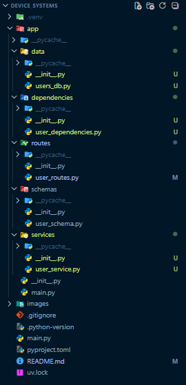

## Manejo de errores y códigos de estado

La API utiliza códigos HTTP para saber el resultado de la operacion:

| Código | Significado | Cuándo ocurre |
|--------|-------------|----------------|
| 200 OK | Éxito | GET /users, GET /users/{id}, actualizaciones exitosas |
| 201 Created | Recurso creado | POST /users (usuario nuevo) |
| 400 Bad Request | Error del cliente | Email duplicado, PATCH sin datos, datos inválidos |
| 404 Not Found | Recurso no existe | GET/PUT/PATCH/DELETE con ID inexistente |
| 422 Unprocessable Entity | Validación fallida | Campos con formato incorrecto (email, role, longitud) |

Los errores se manejan mediante `HTTPException`, lanzando el código y un mensaje descriptivo. Por ejemplo:

```python
raise HTTPException(
    status_code=status.HTTP_404_NOT_FOUND,
    detail="Usuario no encontrado"
)
```

## Dependency Injection (Depends())

FastAPI permite inyectar dependencias mediante la función `Depends()`.

### Dependencias implementadas

- **`get_user_or_404(user_id: int)`**  
  Recibe un ID desde la ruta, busca el usuario y si no existe lanza un error 404. Se usa en `GET /users/{user_id}` y en los futuros endpoints de actualización y eliminación.

```python
# app/dependencies/user_dependencies.py
def get_user_or_404(user_id: int):
    usuario = obtener_por_id(user_id)
    if not usuario:
        raise HTTPException(status_code=404, detail="Usuario no encontrado")
    return usuario
```

## Códigos de estado HTTP usados

| Código | Significado | Cuándo se usa |
|--------|-------------|----------------|
| 200 | OK | GET, PUT, PATCH exitosos |
| 201 | Created | POST exitoso (usuario creado) |
| 204 | No Content | DELETE exitoso (sin contenido) |
| 400 | Bad Request | Email duplicado, PATCH sin campos, datos inválidos de negocio |
| 404 | Not Found | Usuario no existe (por ID) |
| 422 | Unprocessable Entity | Validación de Pydantic falla (nombre corto, email mal formado, rol no permitido) |

## Evidencias de pruebas con capturas de pantalla evidencia 8

A continuación se muestran las capturas realizadas durante las pruebas de la API `device_systems`.

### 1. Actualización completa con PUT – `PUT /users/1` (código 200)

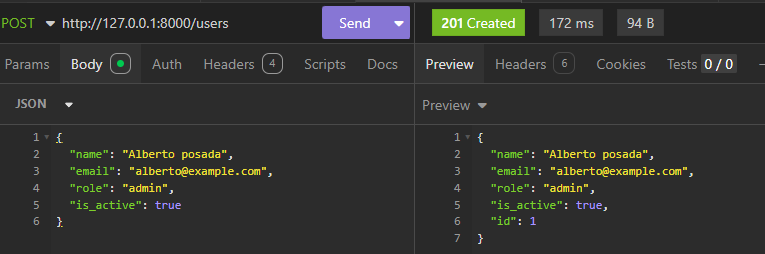
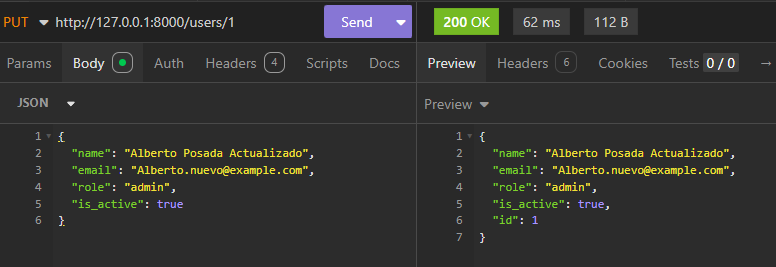

**Propósito:** Que se sepa que el endpoint `PUT` reemplaza completamente los datos de un usuario existente.

**Explicación:** Se envía una petición `PUT` a `/users/1` con un JSON que contiene **todos los campos** (`name`, `email`, `role`, `is_active`). El servidor localiza el usuario con ID 1, reemplaza toda su información y devuelve el objeto actualizado con código `200 OK`. El `id` sigue igual.

### 2. PUT con ID inexistente – `PUT /users/999` (código 404)

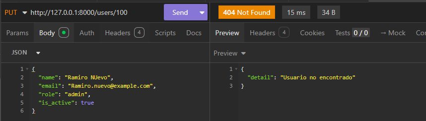

**Propósito:** Verificar que el endpoint `PUT` retorna un error `404 Not Found` cuando se intenta actualizar un usuario que no existe.

**Explicación:** Se envía una petición `PUT` a `/users/999`, un ID que no está registrado en la base de datos. El servidor busca el usuario, no lo encuentra y lanza una excepción `HTTPException` con código 404 y el mensaje `"Usuario no encontrado"`.

### 3. PUT con email duplicado – `PUT /users/1` (código 400)

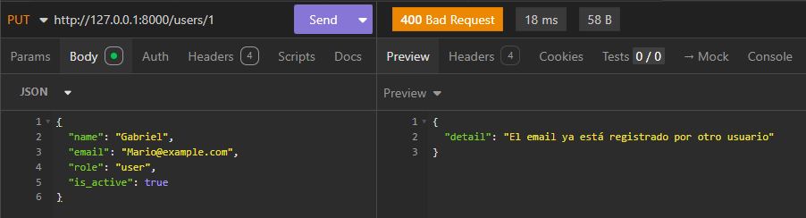

**Propósito:** Validar que el endpoint `PUT` rechaza la actualización si el nuevo email ya está siendo usado por otro usuario.

**Explicación:** Se intenta actualizar el usuario con ID 1 cambiando su email a `"dos@example.com"`, correo que ya pertenece al usuario con ID 2. La API detecta el conflicto y responde con `400 Bad Request` y el mensaje `"El email ya está registrado por otro usuario"`, haciendo que no se pueda colocar el mismo correo

### 4. Actualización parcial con PATCH – cambio de rol (código 200)

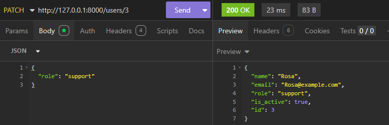

**Propósito:** Demostrar que el endpoint `PATCH` puede modificar solo algunos campos de un usuario sin afectar los demás.

**Explicación:** Se envía una petición `PATCH` a `/users/3` con un JSON que tiene solo `"role": "support"`. El servidor actualiza solo ese campo y devuelve el usuario completo con el rol modificado, manteniendo el resto de la información intacta. El código de respuesta es `200 OK`.

### 5. PATCH sin campos – error 400

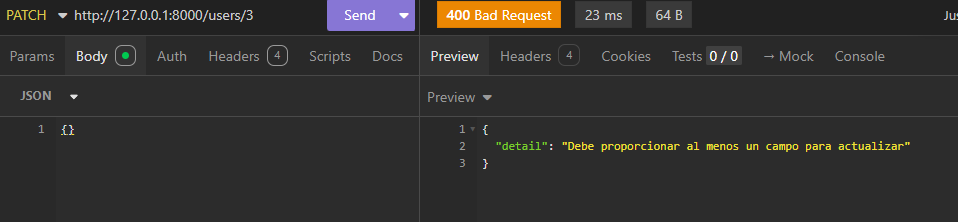

**Propósito:** Verificar que el endpoint `PATCH` rechaza una petición que no incluye ningún campo para actualizar.

**Explicación:** Se envía una petición `PATCH` con un body vacío `{}`. El servidor detecta que no se proporcionó ningún campo válido y responde con `400 Bad Request` y el mensaje `"Debe proporcionar al menos un campo para actualizar"`. Esto evita actualizaciones sin efecto.

### 6. PATCH con email duplicado – error 400

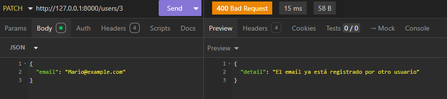

**Propósito:** Validar que el endpoint `PATCH` también controla la unicidad del email cuando se intenta actualizar este campo.

**Explicación:** Se envía una petición `PATCH` para cambiar el email del usuario ID 1 a `"dos@example.com"`, correo que ya está en uso por el usuario ID 2. La API rechaza la operación con código `400 Bad Request` y el mensaje `"El email ya está registrado por otro usuario"`.

### 7. Documentación Swagger UI – endpoints PUT y PATCH

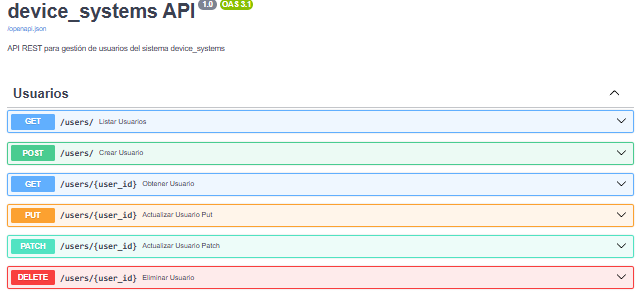

**Propósito:** Mostrar que la documentación automática de FastAPI incluye los nuevos métodos PUT, PATCH y DELETE para el recurso `users`.

**Explicación:** En `http://localhost:8000/docs` se listan ahora todos los métodos del CRUD: GET, POST, PUT, PATCH y DELETE. Cada endpoint muestra sus parámetros, el esquema de cuerpo esperado y los posibles códigos de respuesta.

### 8. Eliminación exitosa con DELETE – `DELETE /users/1` (código 204)

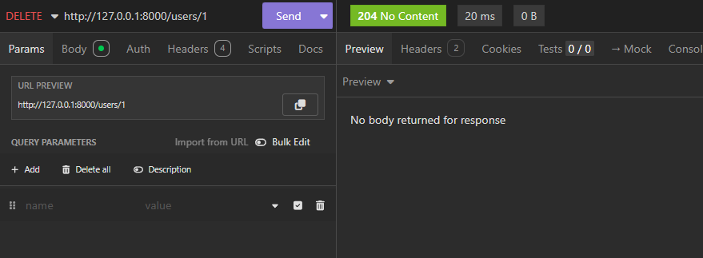

**Propósito:** Verificar que el endpoint `DELETE` elimina correctamente un usuario existente y responde con `204 No Content`.

**Explicación:** Se envía una petición `DELETE` a `/users/1`. El servidor localiza el usuario, lo elimina de la base de datos en memoria y responde con código `204 No Content`. Este código muestra que fue exitosa pero no hay contenido en el cuerpo de la respuesta, lo que es normal para eliminaciones.

### 9. DELETE con ID inexistente – `DELETE /users/999` (código 404)

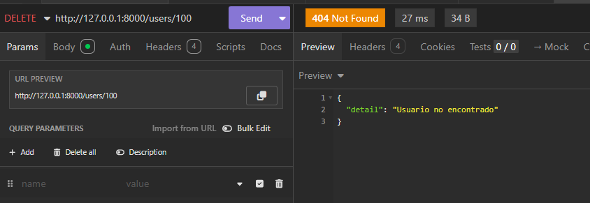

**Propósito:** Demostrar que el endpoint `DELETE` retorna `404 Not Found` cuando se intenta eliminar un usuario que no existe.

**Explicación:** Se envía `DELETE /users/999`, un ID que no está registrado. El servidor busca el usuario, no lo encuentra y lanza una excepción `HTTPException` con código `404` y el mensaje `"Usuario no encontrado"`.

### 10. Lista de usuarios después de eliminación – `GET /users`

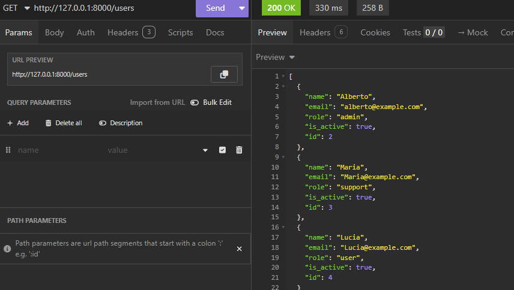

**Propósito:** Confirmar que el usuario eliminado ya no aparece en la lista de usuarios.

**Explicación:** Después de ejecutar `DELETE /users/1`, se realiza una petición `GET /users`. La respuesta ya no incluye al usuario con ID 1, lo que confirma que la eliminación fue efectiva.

### Link Video Youtube Evidencia 8

https://youtu.be/mbI-lIyH41w

# GA1-220501096-01-AA1-EV09 – FastAPI con SQLAlchemy: Persistencia de Datos y CRUD sobre Base de Datos en device_systems

## Estructura del proyecto

Se ha reorganizado el proyecto añadiendo las carpetas `database/` y `models/` que es donde estara la configuración de conexión a la base de datos y el modelo SQLAlchemy. La estructura actual es la siguiente:

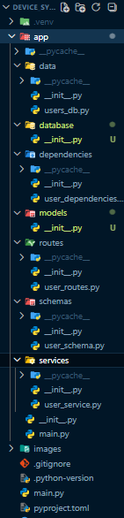

**Explicación:** Se crearon las carpetas `database/` y `models/` dentro de `app/` para separar la lógica de conexión a la base de datos y la definición de las tablas. Las carpetas existentes (`routes/`, `schemas/`, `services/`, `dependencies/`) se mantienen y serán modificadas para trabajar con la base de datos real.

---

## Instalación de dependencias

Se añadio **SQLAlchemy** como ORM para interactuar con la base de datos relacional. A continuación se muestra la instalación y el archivo `requirements.txt` actualizado.

### Instalación de SQLAlchemy

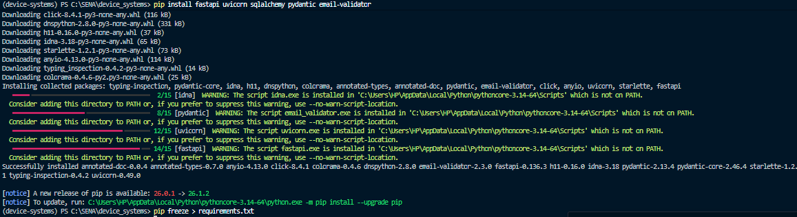

**Propósito:** Incorporar SQLAlchemy y otras dependencias necesarias al proyecto.

**Explicación:** Se ejecutó `pip install fastapi uvicorn sqlalchemy pydantic email-validator` dentro del entorno virtual. La instalación fue exitosa, como se observa en la terminal.

### Archivo requirements.txt actualizado

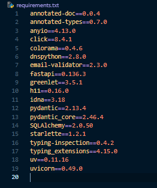

**Propósito:** Mantener un registro de todas las dependencias necesarias.

**Explicación:** El comando `pip freeze > requirements.txt` generó el archivo incluyendo `sqlalchemy` junto con las demás dependencias (fastapi, uvicorn, email-validator, etc.). Esto facilita la replicación del entorno en otros equipos.

---

## Configuración de la base de datos (SQLite)

Se creó el archivo `app/database/connection.py` para gestionar la conexión con SQLite. Este archivo contiene:

- **Engine**: motor que maneja el pool de conexiones.
- **SessionLocal**: fábrica de sesiones para interactuar con la base de datos.
- **Base**: clase padre para todos los modelos SQLAlchemy.
- **get_db()**: función generadora que inyecta una sesión por petición.

### Generación del archivo de base de datos

En `app/main.py` se añadió **Base.metadata.create_all(bind=engine)** antes de crear la app FastAPI. Al ejecutar el servidor por primera vez, SQLAlchemy crea automáticamente el archivo `device_systems.db` en la raíz del proyecto pero todavía esta vacío, porque el modelo User se creará en la fase 5.

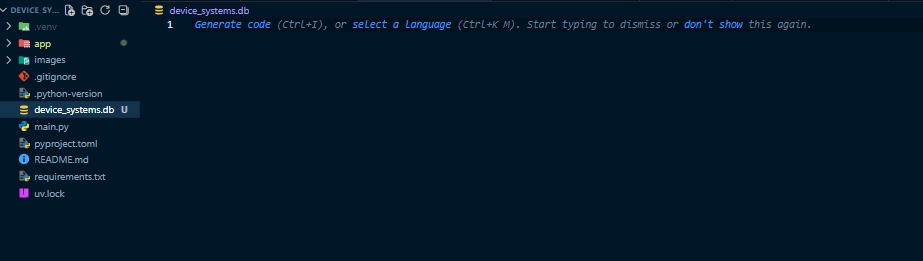

## Modelo SQLAlchemy User

Se creó el modelo `User` en `app/models/user_model.py`. Este modelo define la estructura de la tabla `users` en la base de datos.

### Generación de la tabla

En `app/main.py` se importó el modelo `User` antes de llamar a `Base.metadata.create_all(bind=engine)`. Al ejecutar el servidor, SQLAlchemy creó automáticamente la tabla `users` en la base de datos `device_systems.db`.

### Vista de la tabla desde DB Browser for SQLite

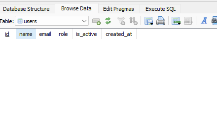

### Explicación de los campos y restricciones

| Campo | Tipo | Restricción | Descripción |
|---------|---------|---------|---------|
| `id` | INTEGER | PRIMARY KEY, INDEX | Identificador único |
| `name` | VARCHAR(100) | NOT NULL | Nombre obligatorio |
| `email` | VARCHAR(255) | UNIQUE, NOT NULL, INDEX | Email único y obligatorio |
| `role` | VARCHAR(20) | NOT NULL | Rol del usuario (`admin`, `support`, `user`) |
| `is_active` | BOOLEAN | NOT NULL, DEFAULT True | Activo por defecto |
| `created_at` | DATETIME | NOT NULL, DEFAULT CURRENT_TIMESTAMP | Fecha de creación automática |

## Schemas Pydantic actualizados

Se actualizaron los schemas Pydantic para trabajar con la base de datos y el nuevo campo `created_at`.

### Schemas definidos

| Schema | Propósito | Campos |
|--------|-----------|--------|
| `UserCreate` | Crear usuario | name, email, role, is_active |
| `UserUpdate` | Actualización completa | name, email, role, is_active (todos obligatorios) |
| `UserPatch` | Actualización parcial | name?, email?, role?, is_active? (todos opcionales) |
| `UserResponse` | Respuesta de la API | id, name, email, role, is_active, **created_at** |

### Código actualizado

```python
from pydantic import BaseModel, Field, EmailStr
from enum import Enum
from typing import Optional
from datetime import datetime

class RoleEnum(str, Enum):
    admin = "admin"
    support = "support"
    user = "user"

class UserBase(BaseModel):
    name: str = Field(..., min_length=3)
    email: EmailStr = Field(...)
    role: RoleEnum = Field(default=RoleEnum.user)
    is_active: bool = Field(default=True)

class UserCreate(UserBase):
    pass

class UserUpdate(UserBase):
    pass

class UserPatch(BaseModel):
    name: Optional[str] = Field(None, min_length=3)
    email: Optional[EmailStr] = Field(None)
    role: Optional[RoleEnum] = Field(None)
    is_active: Optional[bool] = Field(None)

class UserResponse(UserBase):
    id: int
    created_at: datetime

    class Config:
        from_attributes = True
```
## Configuración importante

En `UserResponse` se agregó `from_attributes = True`. Esto permite que FastAPI convierta automáticamente un objeto SQLAlchemy (`User`) a un schema Pydantic, sin necesidad de transformarlo manualmente.

### Configuración en Pydantic

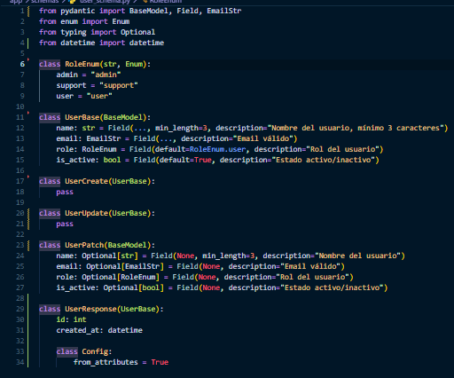